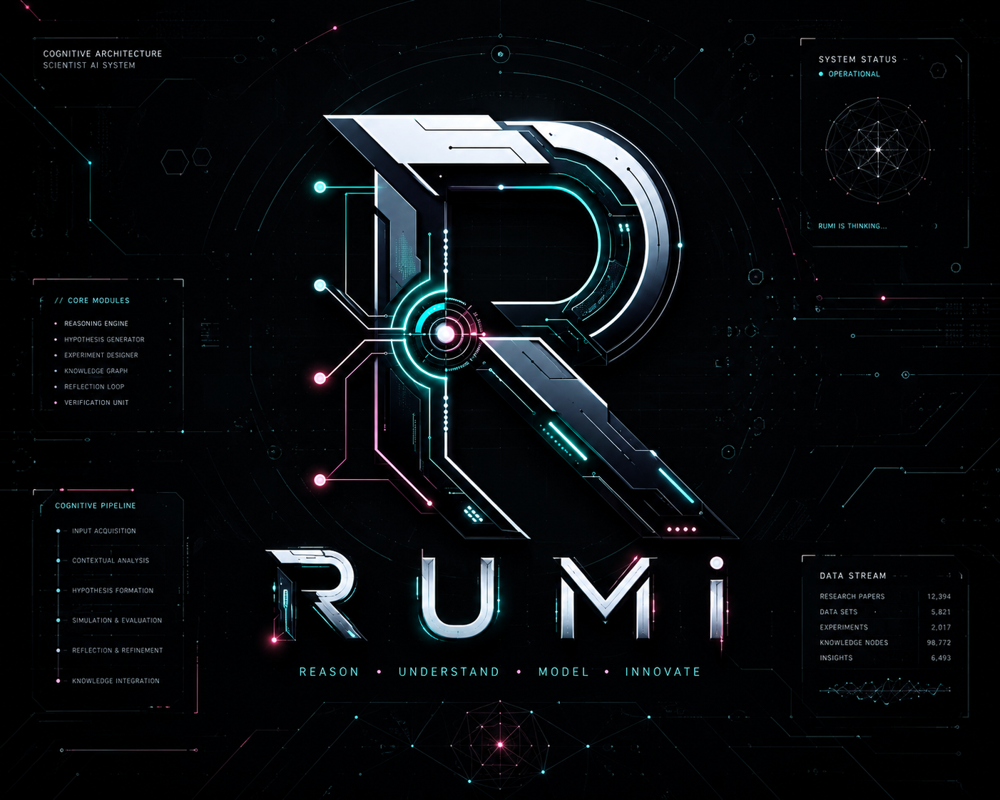
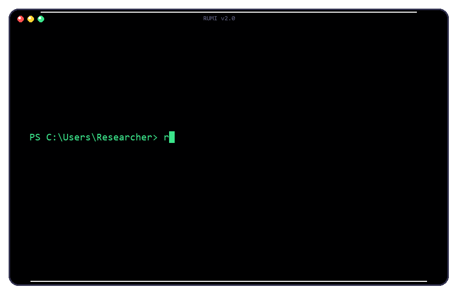
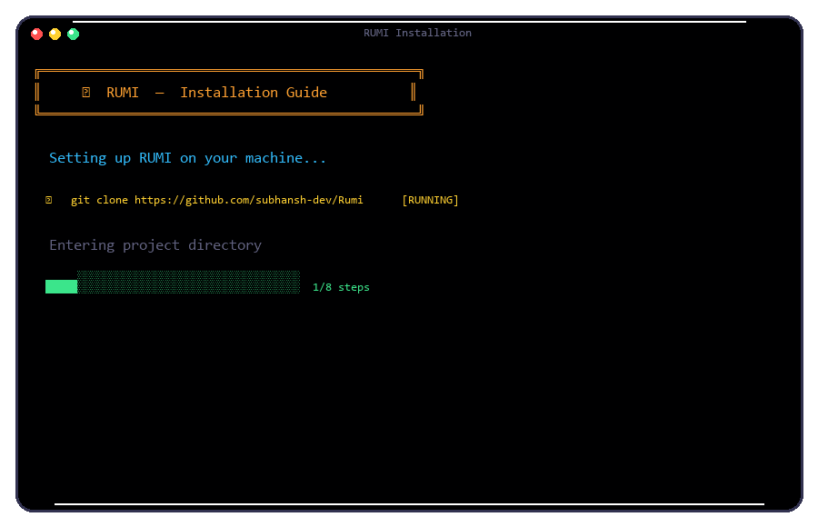
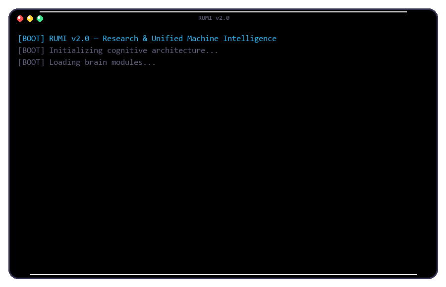

# 🧬 RUMI — Research & Unified Machine Intelligence

<p align="center">
  
</p>

<p align="center">
  <a href="https://github.com/subhansh-dev/Rumi/stargazers">
    
  </a>
  <a href="https://github.com/subhansh-dev/Rumi/forks">
    
  </a>
  <a href="https://github.com/subhansh-dev/Rumi/issues">
    
  </a>
  <a href="https://github.com/subhansh-dev/Rumi/blob/main/LICENSE">
    
  </a>
  <a href="https://python.org/versions/3.12">
    
  </a>
</p>

<p align="center">
  <b>Autonomous Cognitive AI for Scientific Research & Software Engineering</b><br>
  Terminal-native. 60+ Brain Modules. 15 Scientist Modules. Zero bloat.
</p>

<p align="center">
  
</p>

---

## 📋 Table of Contents

- [About RUMI](#-about-rumi)
- [Motivation](#-motivation)
- [Cognitive Architecture](#-cognitive-architecture)
- [Scientist AI Pipeline](#-scientist-ai-pipeline)
- [Brain Systems (60+ Modules)](#-brain-systems-60-modules)
- [Features Overview](#-features-overview)
- [Tech Stack](#-tech-stack)
- [Installation](#-installation)
- [Configuration](#-configuration)
- [Telegram Integration](#-telegram-integration)
- [Usage](#-usage)
- [Example Prompts](#-example-prompts)
- [Project Structure](#-project-structure)
- [Contributing](#-contributing)
- [License](#-license)

---

## 🧪 About RUMI

**RUMI** (Research & Unified Machine Intelligence) is a terminal-native autonomous cognitive AI assistant engineered specifically for scientists, engineers, and power users. It bridges the gap between raw LLM capability and autonomous scientific research by combining a sophisticated cognitive architecture — memory, reasoning, planning, consciousness modeling — with a dedicated Scientist AI pipeline for end-to-end research.

| Dimension | RUMI |
|-----------|------|
| **Interface** | Terminal-native (Rich + prompt_toolkit) — no bloat |
| **Model** | Gemini 2.5 Flash, multi-model routing for specialized scientific tasks |
| **Architecture** | 60+ cognitive brain modules + 15 Scientist AI modules |
| **Memory** | 9-type system: neural, episodic, vector, procedural, working, associative, predictive, consolidated, global workspace |
| **Learning** | Active inference, curiosity-driven exploration, dreaming (offline replay), meta-learning |
| **Reasoning** | Causal (Pearl's hierarchy), analogical (Gentner's structure mapping), neurosymbolic, first-principles |
| **Cognition** | Dual-process (System 1 fast / System 2 deliberate), integrated information (IIT-φ), metacognition |

---

## 🎯 Motivation

Contemporary AI assistants share a fundamental limitation: they are stateless. Each session begins from zero — no memory of prior interactions, no model of the user, no awareness of their own capabilities. They are reactive, waiting for commands rather than anticipating needs. They are single-model systems, routing everything through one inference call regardless of task complexity.

RUMI addresses these limitations by implementing a cognitive architecture that mirrors aspects of human cognition, purpose-built for the scientific research lifecycle:

| Dimension | Conventional Assistants | RUMI |
|-----------|------------------------|-------|
| **Memory** | Stateless per session | 9-type persistent memory with Hebbian learning, episodic recall, semantic vector search, and procedural templates |
| **Initiative** | Reactive — waits for commands | Proactive — curiosity-driven exploration, autonomous research goal pursuit |
| **Reasoning** | Single-pass generation | Multi-pass: cognitive gating, causal (Pearl), analogical (Gentner), neurosymbolic, first-principles |
| **Self-awareness** | None | Self-model with confidence calibration, introspection engine, metacognitive monitoring |
| **Learning** | No feedback loop | Error-driven updates, experience replay, dreaming-based consolidation, meta-learning |
| **Research** | Search-and-summarize | Discovery Engine (5-phase drug discovery + multi-domain science: materials, neuroscience, molbio, climate), knowledge graph, mathematical metrics, contradiction detection, molecule design |
| **Discovery** | None | Domain-aware pipeline: auto-detect domain (drug/materials/neuro/molbio/climate/general), PubMed → entity extraction → knowledge graph → PubChem/OpenFDA/UniProt enrichment → graph metrics → hypotheses → domain-specific generation |
| **Cognition** | None | Dual-process (System 1/2), IIT-inspired integrated information (Φ), global workspace coordination |

---

## 🧬 Cognitive Architecture

RUMI routes inputs through a layered pipeline inspired by dual-process theory and cognitive neuroscience:

```
┌─────────────────────────────────────────────────────────────────────┐
│                        PERCEPTION LAYER                              │
│     Voice Input ──► Text ──► Gemini Live API ──► Audio Out           │
└───────────────────────────────────┬──────────────────────────────────┘
                                    │
┌───────────────────────────────────▼──────────────────────────────────┐
│                         MEMORY LAYER                                 │
│  ┌──────────┐ ┌───────────┐ ┌──────────┐ ┌───────────────────┐      │
│  │  Neural  │ │  Episodic │ │  Vector  │ │    Procedural     │      │
│  │ (Hebbian)│ │  (Events) │ │ (Search) │ │  (Skill Memory)   │      │
│  └──────────┘ └───────────┘ └──────────┘ └───────────────────┘      │
│  ┌──────────────────────────────────────────────────────────────┐   │
│  │           Memory Coordinator (unified recall)                 │   │
│  └──────────────────────────────────────────────────────────────┘   │
└───────────────────────────────────┬──────────────────────────────────┘
                                    │
┌───────────────────────────────────▼──────────────────────────────────┐
│                       INFERENCE LAYER                                │
│  Active Inference ──► Prediction-Error Minimization (FEP)            │
│  Curiosity Engine ──► Novelty Detection ──► Exploration Drive        │
│  Cognitive Gating ──► System 1 (fast) vs System 2 (deliberate)      │
└───────────────────────────────────┬──────────────────────────────────┘
                                    │
┌───────────────────────────────────▼──────────────────────────────────┐
│                       REASONING LAYER                                │
│  Causal (Pearl) ──► Analogy (Gentner) ──► Neurosymbolic               │
│  Narrative ──► Creativity ──► Intuition (Recognition-Primed)         │
└───────────────────────────────────┬──────────────────────────────────┘
                                    │
┌───────────────────────────────────▼──────────────────────────────────┐
│                      REFLECTION LAYER                                │
│  Dreaming ──► Experience Replay ──► Pattern Extraction               │
│  Meta-Reflection ──► Decision Journal ──► Strategy Scoring           │
└───────────────────────────────────┬──────────────────────────────────┘
                                    │
┌───────────────────────────────────▼──────────────────────────────────┐
│                         SCIENTIST AI LAYER                            │
│  Pipeline Orchestrator ──► Research Team ──► Knowledge Graph         │
│  (12 phases)             (5-role debate)    (multi-hop reasoning)    │
│                       Paper Generator                                │
│                    (BibTeX + peer review)                            │
└───────────────────────────────────┬──────────────────────────────────┘
                                    │
┌───────────────────────────────────▼──────────────────────────────────┐
│                      IDENTITY LAYER                                  │
│  Self-Model ──► Self-Awareness ──► Consciousness (IIT-Φ)             │
│  Theory of Mind ──► Emotional Regulation ──► Metacognitive Monitor   │
│  Global Workspace (Thalamus) ──► Multi-Module Coordination           │
└───────────────────────────────────┬──────────────────────────────────┘
                                    │
┌───────────────────────────────────▼──────────────────────────────────┐
│                      ACTION LAYER                                    │
│  40+ Tool Actions ──► Execution ──► Verification ──► Learning        │
└──────────────────────────────────────────────────────────────────────┘
```

### Dual-Process Theory (System 1 vs System 2)

- **System 1 (Fast):** Immediate pattern-matching and responses. Used for factual answers, single tool calls, simple lookups.
- **System 2 (Deliberate):** Multi-pass reasoning, planning, simulation, reflection, and self-correction. Used for multi-step problems, architecture, security, debugging.

### Research Foundations

RUMI's cognitive architecture is grounded in peer-reviewed research:

| Research Area | Researcher(s) | Core Idea |
|--------------|---------------|-----------|
| **Global Workspace Theory** | Bernard Baars (1988) | Consciousness as a broadcast mechanism — competing processors share a central "stage" |
| **Integrated Information Theory** | Giulio Tononi (2004) | Consciousness as Φ — integrated information a system generates |
| **Free Energy Principle** | Karl Friston (2010) | All adaptive systems minimize prediction error through perception and action |
| **Dual Process Theory** | Daniel Kahneman (2011) | System 1 (fast) vs System 2 (slow) reasoning |
| **Recognition-Primed Decisions** | Gary Klein (1998) | Experts decide by pattern matching, not deliberation |
| **Structure Mapping Theory** | Dedre Gentner (1983) | Analogical reasoning as the core of intelligence |
| **Causal Hierarchy** | Judea Pearl (2018) | Association → Intervention → Counterfactual |
| **Society of Mind** | Marvin Minsky (1986) | Intelligence as emergent competition between simple agents |
| **Metacognition** | John Flavell (1979) | Thinking about thinking — monitoring and regulating cognition |
| **Computational Creativity** | Margaret Boden (2004) | Exploration, combination, transformation of conceptual spaces |
| **World Models** | Ha & Schmidhuber (2018) | Mental simulation before action — learning in a dreamed environment |

---

## 🔬 Discovery Engine

RUMI's **Discovery Engine** is a multi-domain scientific discovery pipeline — from literature mining to generated candidates. Supports 6 domains with auto-detection.

### Domains

| Domain | Key | Entity Types | Enrichment | Generation |
|--------|-----|-------------|------------|------------|
| Drug Discovery | `drug_discovery` | drug, disease, gene, protein, mechanism, pathway, cell_type | PubChem + OpenFDA | Molecules |
| Materials Science | `materials_science` | material, compound, property, synthesis_method, application, element | PubChem | Materials |
| Neuroscience | `neuroscience` | brain_region, neurotransmitter, disorder, gene, behavior, neuron_type | UniProt | Hypotheses |
| Molecular Biology | `molecular_biology` | gene, protein, pathway, organism, phenotype, cell_type | UniProt | Hypotheses |
| Climate & Energy | `climate_energy` | emission_source, technology, policy, impact, region, resource | — | Hypotheses |
| General Science | `general` | concept, method, finding, technology, organism, material | — | Hypotheses |

Auto-detect: `/discover battery cathodes` → materials science  
Manual: `/discover materials: battery cathodes` or `/domain materials_science`

### Pipeline

```
/discover <topic>
  → Auto-detect domain (or manual: /discover <domain>: <topic>)
  → PubMed search & fetch
  → LLM entity extraction (domain-specific types)
  → Knowledge graph build & persist with domain metadata
  → Domain-specific enrichment (PubChem / OpenFDA / UniProt)
  → Mathematical graph metrics (Jaccard, betweenness, degree, density, entropy, clustering, edge strength)
  → Pattern mining + hypothesis generation with domain-aware definitions
  → Web dashboard (vis-network graph + hypothesis browser)

/contradictions
  → Direct relation conflicts, confidence anomalies, side-effect contradictions, path-based conflicts

/generate <target>
  → Gemini SMILES generation → RDKit validation → PubChem lookup → graph novelty scoring

/enrich       — Enrich existing graph (source depends on domain)
/hypothesize  — Re-mine hypotheses from existing graph
/dashboard    — Open interactive web dashboard
/discoveries  — List past discovery sessions
/domain       — Show or set current domain
/domains      — List all available domains
```

### Modules

| Module | Location | Purpose |
|--------|----------|---------|
| **PubMed Miner** | `discovery/pubmed.py` | ESearch + EFetch, rate-limited, XML parsing |
| **Knowledge Graph** | `discovery/graph.py` | Entities, relationships, merge, metrics, contradiction detection, domain metadata |
| **Domain Config** | `discovery/domains.py` | 6 domain definitions with entity types, colors, enrichment sources, generation type |
| **PubChem Enrichment** | `discovery/pubchem.py` | Compound search, targets, properties via PUG REST |
| **OpenFDA Enrichment** | `discovery/openfda.py` | Side effects, labeling via openFDA API |
| **UniProt Enrichment** | `discovery/uniprot.py` | Gene/protein lookup (free REST, no key needed) |
| **Molecule Designer** | `discovery/molecule.py` | Gemini SMILES → RDKit validation → PubChem → scoring |
| **Output** | `discovery/output.py` | Terminal formatting, session saving |
| **Dashboard** | `discovery/dashboard/index.html` | vis-network graph + tabs for hypotheses, contradictions, molecules |

---

## 🧠 Brain Systems (60+ Modules)

### Memory Systems

| Module | File | Purpose |
|--------|------|---------|
| **Neural Memory** | `brain/neural_memory.py` | Long-term facts, Hebbian learning, synaptic decay, pattern completion |
| **Episodic Memory** | `brain/episodic_memory.py` | Timestamped events with importance scoring and retrieval |
| **Vector Memory** | `brain/vector_memory.py` | Semantic search via embeddings for fast retrieval |
| **Procedural Memory** | `brain/procedural_memory.py` | Learns successful tool chains as reusable skill templates |
| **Associative Memory** | `brain/associative_memory.py` | Spreading activation networks for context-dependent recall |
| **Predictive Memory** | `brain/predictive_memory.py` | Anticipatory recall — pre-loads relevant memories before request |
| **Memory Consolidation** | `brain/memory_consolidation.py` | Sleep-like compression of episodic → semantic knowledge |
| **Memory Coordinator** | `brain/memory_coordinator.py` | Unified recall across all memory stores |

### Learning & Adaptation

| Module | File | Purpose |
|--------|------|---------|
| **Active Inference** | `brain/active_inference.py` | Free Energy Principle — minimizes prediction error through Bayesian updating |
| **Learning Engine** | `brain/learning.py` | Error-driven updates, Q-learning for tool selection, user feedback integration |
| **Curiosity Engine** | `brain/curiosity.py` | Information-seeking behavior, novelty detection, uncertainty-driven exploration |
| **Dreaming System** | `brain/dreaming.py` | Offline experience replay, pattern extraction, memory consolidation |
| **Meta-Learner** | `brain/meta_learner.py` | Learning to learn — extracts transferable learning strategies |
| **Transfer Learning** | `brain/transfer_learning.py` | Cross-domain pattern transfer and abstraction |
| **Self-Improve Engine** | `brain/self_improve_engine.py` | RLHF-inspired: stores action-outcome pairs, extracts lessons from failures |

### Reasoning Systems

| Module | File | Purpose |
|--------|------|---------|
| **Causal Reasoner** | `brain/causal_reasoner.py` | Pearl's Causal Hierarchy — Association → Intervention → Counterfactual |
| **Analogy Engine** | `brain/analogy_engine.py` | Gentner's Structure Mapping Theory for fluid intelligence |
| **Neurosymbolic Reasoner** | `brain/neurosymbolic_reasoner.py` | Combines LLM reasoning with SymPy formal logic verification |
| **Narrative Intelligence** | `brain/narrative_intelligence.py` | Turns experiences into stories, identity evolution tracking |
| **Creativity Engine** | `brain/creativity_engine.py` | Conceptual blending, constraint relaxation, bisociation for novel ideas |
| **Intuition Engine** | `brain/intuition_engine.py` | Fast pattern matching — Recognition-Primed Decision Making (System 1) |
| **Cognitive Integration** | `brain/cognitive_integration.py` | Orchestrates all reasoning modules into a unified cognitive pipeline |
| **Module Competition** | `brain/module_competition.py` | Minsky Society of Mind — modules bid for processing rights |

### Consciousness & Self-Awareness

| Module | File | Purpose |
|--------|------|---------|
| **Self-Awareness** | `brain/self_awareness.py` | Consciousness state tracking, emotional state management |
| **Self-Model** | `brain/self_model.py` | Capability awareness, confidence calibration, growth tracking |
| **Theory of Mind** | `brain/theory_of_mind.py` | User expertise modeling, intent inference, emotional state tracking |
| **Metacognitive Monitor** | `brain/metacognitive_monitor.py` | Thinking quality tracking, calibration, strategy effectiveness |
| **Introspection Engine** | `brain/introspection_engine.py` | Confidence calibration, cognitive bias detection (12 types), epistemic humility |
| **Emotional Regulation** | `brain/emotional_regulation.py` | Somatic Marker Hypothesis — emotions as decision-pruning signals |
| **Integrated Information** | `brain/integrated_info.py` | Φ (phi) approximation inspired by Tononi's IIT theory |
| **Self-Narrative** | `brain/narrative_intelligence.py` | Evolving story of identity, growth, and experience |
| **Global Workspace** | `brain/global_workspace.py` | Thalamus-inspired multi-module coordination and broadcast |

### Planning & Autonomy

| Module | File | Purpose |
|--------|------|---------|
| **Autonomous Planner** | `brain/autonomous_planner.py` | MCTS-inspired plan decomposition with dependency tracking |
| **Goal Engine** | `brain/goal_engine.py` | Hierarchical goal management — life goals → project goals → tasks |
| **Intrinsic Motivation** | `brain/intrinsic_motivation.py` | Self-Determination Theory: autonomy, competence, relatedness drives |
| **Hierarchical Active Inference** | `brain/hierarchical_active_inference.py` | 3-level FEP hierarchy: Meta → Subgoal → Action |
| **Proactive Engine** | `brain/proactive_engine.py` | Anticipates needs, idle check-ins, returning-user greetings |
| **Cognitive Load Manager** | `brain/cognitive_load.py` | Working memory monitoring (7±2 slots), overload detection |
| **AGI Orchestrator** | `brain/agi_orchestrator.py` | Master coordinator wiring all cognitive modules into a unified loop |
| **Multi-Agent Orchestrator** | `brain/multi_agent_orchestrator.py` | Parallel, debate, pipeline, voting, specialist, swarm execution modes |

### World Models

| Module | File | Purpose |
|--------|------|---------|
| **World Model** | `brain/world_model.py` | DreamerV3-inspired latent dynamics for outcome prediction |
| **Enhanced World Model** | `brain/enhanced_world_model.py` | Non-linear MLP transitions, ensemble prediction, causal integration |
| **World Simulation** | `brain/world_simulation.py` | Real-time event tracking, trend detection, counterfactual modeling |
| **Abstraction Engine** | `brain/abstraction_engine.py` | First principles reasoning, cross-domain transfer, emergent insight |

---

## 🚀 Features Overview

| Category | Description |
|----------|-------------|
| 🔬 **Discovery Engine** | 6-domain scientific discovery: drug, materials, neuroscience, molbio, climate, general. PubMed → domain-specific extraction → graph → enrichment (PubChem/OpenFDA/UniProt) → metrics → hypotheses → molecules. Auto-detect or manual domain. |
| 🧠 **Cognition** | 60+ brain modules — causal reasoning, analogy, active inference, curiosity, metacognition, dreaming, learning |
| 🌐 **Research** | Paper search (arXiv + Semantic Scholar), deep web research, scientific knowledge graphs |
| 🧠 **Memory** | 9 memory types — neural, episodic, vector, procedural, working, global workspace, associative, predictive, consolidated |
| 🤖 **Scientist Agents** | 11 specialized research agent personas: literature reviewer, hypothesis generator, experiment designer, paper writer, peer reviewer, novelty analyst, cross-domain bridge, reproducibility engineer, data analyst, knowledge curator, research coordinator |
| 🎯 **Autonomy** | Goal engine, intrinsic motivation, curiosity drive, proactive exploration, self-improvement |
| 🛡️ **Security** | Permission management, audit logging, rate limiting, input sanitization, config validation |
| 🔄 **Learning** | Error-driven updates, Q-learning, meta-reflection, experience replay, dreaming consolidation |
| 📊 **Data** | CSV/JSON analysis with Polars, chart generation, data querying |

### Tool Actions (40+)

| Category | Tools |
|----------|-------|
| 🔬 **Scientist** | `scientist_pipeline`, `scientist_discovery`, `scientist_analyze`, `scientist_experiment`, `scientist_paper`, `scientist_team`, `scientist_tournament`, `scientist_knowledge_graph`, `scientist_reproducibility`, `scientist_cross_domain`, `scientist_lab_notebook`, `scientist_search`, `paper_search`, `hypothesis_manage` |
| 🧠 **Cognition** | `cognitive_reason`, `analogy_reason`, `causal_analyze`, `creative_solve`, `intuition_check`, `consciousness_state`, `meta_reflect`, `cognitive_load_check` |
| 🌐 **Research** | `web_search`, `web_research`, `deep_dive`, `paper_search`, `scientist_search`, `browser_control` |
| 🧠 **Memory** | `brain_memory`, `save_memory`, `memory_stats`, `record_learning`, `reflect_learning` |
| 🤖 **Scientist Agents** | `agency_agent` (literature_reviewer, hypothesis_generator, experiment_designer, paper_writer, peer_reviewer, novelty_analyst, cross_domain_bridge, reproducibility_engineer, data_analyst, knowledge_curator, research_coordinator) |
| 📊 **Data** | `data_analysis`, `integration_status` |
| 🖥️ **System** | `file_controller`, `computer_control`, `desktop_control`, `open_app` |
| 🛡️ **Security** | `security_tools`, `self_audit` |
| 🔄 **System** | `agi_status`, `self_model_status`, `curiosity_queue`, `run_dream_cycle`, `force_learning`, `api_server`, `system_sentinel`, `shutdown_rumi` |

---

## 🛠️ Tech Stack

| Layer | Technology |
|-------|-----------|
| **AI Models** | Gemini 2.5 Flash, multi-model routing |
| **Language** | Python 3.12+ |
| **Terminal UI** | Rich (markdown, panels, tables) + prompt_toolkit |
| **Browser** | Playwright |
| **System** | psutil, pywin32 |
| **Storage** | JSON, JSONL |
| **Cheminformatics** | RDKit (MW, LogP, QED, Lipinski, TPSA, SMILES) |
| **Discovery APIs** | PubMed Entrez, PubChem PUG REST, OpenFDA |
| **Networking** | google-genai, httpx, websockets, requests |
| **Data Analysis** | Polars, Matplotlib |
| **API Server** | FastAPI, Uvicorn, Pydantic |
| **Scheduling** | APScheduler |
| **Vision** | OpenCV, mss, pillow |
| **Math** | SymPy |

---

## 📦 Installation

### Prerequisites

| Requirement | Details |
|-------------|---------|
| **Python** | 3.12 or higher ([download](https://python.org/downloads)) |
| **Git** | Any recent version |
| **OS** | Windows (primary), Linux/macOS (partial support) |
| **RAM** | 4GB+ (8GB recommended) |
| **Storage** | ~500MB for RUMI + ~400MB for Playwright browsers |
| **API Key** | Gemini API key — free at [aistudio.google.com](https://aistudio.google.com/app/apikey) |

### Step 1 — Clone the Repository

```bash
git clone https://github.com/subhansh-dev/Rumi
cd rumi
```

### Step 2 — Create a Virtual Environment

**Windows:**
```powershell
python -m venv rumi_env
rumi_env\Scripts\activate
```

**Linux/macOS:**
```bash
python3 -m venv rumi_env
source rumi_env/bin/activate
```

### Step 3 — Install Dependencies

```bash
# Core installation (all dependencies)
pip install -e .

# Or install from requirements.txt directly:
pip install -r requirements.txt
```

### Step 4 — Install Playwright Browser

```bash
playwright install chromium
```

### Step 5 — Configure Your API Key

Create or edit `config/api_keys.json`:

```json
{
    "GOOGLE_API_KEY": "your-gemini-api-key-here",
    "os_system": "windows"
}
```

Get a free Gemini API key: [aistudio.google.com/app/apikey](https://aistudio.google.com/app/apikey)

### Step 6 — Launch RUMI

```bash
# Using the CLI command:
rumi

# Or directly:
python rumi_launcher.py
```

On first launch, RUMI will check your configuration and initialize all cognitive modules. You should see the terminal UI with the RUMI logo and a prompt.

<p align="center">
  
</p>

### Troubleshooting

| Problem | Solution |
|---------|----------|
| `ModuleNotFoundError` | Ensure virtual environment is activated and `pip install -e .` was run |
| `GOOGLE_API_KEY not found` | Check `config/api_keys.json` has the correct key |
| `playwright not found` | Run `playwright install chromium` |
| `No module named 'brain.*'` | Make sure you're running from the `rumi/` project root |


---

## ⚙️ Configuration

| File | Purpose |
|------|---------|
| `config/api_keys.json` | Gemini API key and optional settings |
| `core/prompt.txt` | System personality prompt |
| `RUMI.md` | Identity and behavioral guidelines |
| `SOUL.md` | Core directives and red lines |
| `USER.md` | User profile |
| `memory/` | Persistent memory (long-term + daily logs) |

### Environment Variables

| Variable | Description |
|----------|-------------|
| `RUMI_TELEGRAM_BOT_TOKEN` | Telegram bot token for remote control |
| `RUMI_TELEGRAM_ALLOWED_USER` | Allowed Telegram user ID (numeric) |

---

## 🤖 Telegram Integration

RUMI supports two-way Telegram communication — you can chat with RUMI from your phone via a Telegram bot.

### Step 1 — Create Your Telegram Bot

1. Open Telegram and search for **@BotFather**
2. Send `/newbot`
3. Follow the prompts to name your bot (e.g. "RUMI Assistant")
4. BotFather will give you a token like `7234567890:AAH...` — **save this**

### Step 2 — Get Your User ID

1. Search **@userinfobot** on Telegram
2. Send any message
3. It will reply with your numeric User ID (e.g. `123456789`) — **save this**

### Step 3 — Configure RUMI

Add to `config/api_keys.json`:
```json
{
    "GOOGLE_API_KEY": "your-gemini-api-key",
    "telegram_bot_token": "7234567890:AAH...",
    "telegram_allowed_user": 123456789,
    "os_system": "windows"
}
```

Or use environment variables:
```powershell
# Windows PowerShell
$env:RUMI_TELEGRAM_BOT_TOKEN = "7234567890:AAH..."
$env:RUMI_TELEGRAM_ALLOWED_USER = "123456789"
```

```bash
# Linux/macOS
export RUMI_TELEGRAM_BOT_TOKEN="7234567890:AAH..."
export RUMI_TELEGRAM_ALLOWED_USER="123456789"
```

### Step 4 — Test It

1. Launch RUMI (`rumi` or `python rumi_launcher.py`)
2. Send a message to your bot on Telegram
3. RUMI will respond within the terminal and via Telegram

> **Security:** Only the configured `telegram_allowed_user` can communicate with RUMI via Telegram. All other users are ignored.

---

## 📖 Usage

### Launch

```bash
rumi
```

<p align="center">
  
</p>

### Slash Commands

| Command | Description |
|---------|-------------|
| `/help` | Show help |
| `/clear` | Clear screen |
| `/status` | System status and uptime |
| `/stats` | Session statistics |
| `/science` | Scientist AI capabilities |
| `/discover <topic>` | Full pipeline: PubMed → extraction → graph → enrichment → hypotheses |
| `/search <query>` | Quick PubMed search (no extraction) |
| `/enrich` | Enrich existing graph with PubChem + OpenFDA data |
| `/hypothesize [topic]` | Generate new hypotheses from existing graph |
| `/contradictions` | Detect contradictions in knowledge graph |
| `/generate <target>` | Design molecules (e.g., `/generate AMPK activator`) |
| `/graph` | Knowledge graph statistics |
| `/dashboard` | Open web-based interactive dashboard |
| `/discoveries` | List past discovery sessions |
| `/focus` | Toggle Focus mode (respond only when addressed) |
| `/think` | Toggle Think mode (reasoning before responses) |
| `/dive` | Toggle Deep Dive mode (thorough research) |
| `/mute` | Toggle microphone mute |
| `/exit` | Exit RUMI |

---

## 💡 Example Prompts

### 🔬 Scientist AI — Research & Discovery

```
# Full autonomous research pipeline (12 phases)
scientist_pipeline(action="run", topic="emergent abilities in large language models beyond 100B parameters")

# Quick literature + novelty + hypothesis scan
scientist_pipeline(action="quick", topic="neuro-symbolic approaches to mathematical reasoning")

# Curiosity-driven exploration mode
scientist_pipeline(action="explore", topic="")

# Full pipeline with self-improvement analysis
scientist_pipeline(action="iterate", topic="attention mechanisms in transformer architectures", domain="machine_learning")

# View pipeline history and stats
scientist_pipeline(action="history")
scientist_pipeline(action="stats")
```

### 🔬 Scientist AI — Analysis & Validation

```
# Novelty check a research idea
scientist_analyze(action="novelty", topic="using active inference for robot motor control")

# Feynman reduction — simplify a complex concept
scientist_analyze(action="feynman", topic="the Higgs mechanism")

# Peer review findings
scientist_analyze(action="review", topic="transformer efficiency", findings='[{"claim": "Sparse attention reduces compute by 40%"}]')

# Cross-validate experiment results
scientist_analyze(action="validate", topic="quantum machine learning")
```

### 🔬 Scientist AI — Experiments & Papers

```
# Design an experiment
scientist_experiment(action="design", hypothesis="Vision transformers scale better than ConvNets on small datasets", domain="machine_learning", experiment_type="ablation")

# Generate a research paper
scientist_paper(action="generate", topic="The Role of Induction Heads in In-Context Learning", hypothesis="Induction heads are the primary mechanism for in-context learning in transformers", venue="neurips")

# Search papers by famous researcher
scientist_search(action="search", researcher="Richard Feynman", topic="quantum electrodynamics")

# Search academic papers
paper_search(query="mixture of experts in large language models", max_results=15)
```

### 🔬 Scientist AI — Knowledge & Hypotheses

```
# Generate diverse hypotheses with tournament selection
scientist_tournament(action="generate", topic="scaling laws for mixture-of-experts models", domain="computer_science", size=10, generations=5)

# Run hypothesis tournament
scientist_tournament(action="tournament", topic="energy-based models vs diffusion models for image generation")

# Manage hypotheses
hypothesis_manage(action="add", title="Scaling MoE routers improves expert specialization", domain="machine_learning")

# Build and query knowledge graph
scientist_knowledge_graph(action="add_entity", name="attention_is_all_you_need", entity_type="paper", description="Vaswani et al. 2017 - Transformer architecture", domain="machine_learning")
scientist_knowledge_graph(action="query", name="transformer")
scientist_knowledge_graph(action="gaps", domain="machine_learning")

# Cross-domain analogies
scientist_cross_domain(action="analogy", concept="natural selection", source_domain="biology", target_domain="machine_learning")

# Lab notebook
scientist_lab_notebook(action="create", title="Testing Grokking on Modular Addition", hypothesis="Transformers grok modular addition through Fourier features", domain="machine_learning")
scientist_lab_notebook(action="search", query="transformer grokking")

# Reproducibility check
scientist_reproducibility(action="extract", text="[paper text here]")
```

### 🧠 Cognitive Reasoning

```
# Multi-module cognitive reasoning
cognitive_reason(query="What are the implications of category theory for understanding neural network generalization?", depth="deep")

# Analogy reasoning
analogy_reason(source_domain="biology", target_domain="software_engineering", query="How does immune system adaptation inform microservice architecture design?")

# Causal analysis
causal_analyze(events="The model performed well on training data but failed on the test set.", question="what caused the generalization gap?")

# Creative problem solving
creative_solve(problem="Design a new activation function that prevents dead neurons", constraints="must be differentiable, computationally efficient", num_ideas=5)

# Intuition check (System 1 fast reasoning)
intuition_check(situation="Users are reporting memory leaks after 6 hours of runtime", domain="code")

# Consciousness state
consciousness_state(action="full")
```

### 🤖 Scientist Agents

```
# Literature review
agency_agent(agent_name="literature_reviewer", task="Review recent advances in mechanistic interpretability of transformers")

# Hypothesis generation
agency_agent(agent_name="hypothesis_generator", task="Generate novel hypotheses about the relationship between model scale and emergent abilities")

# Experiment design
agency_agent(agent_name="experiment_designer", task="Design an experiment to test whether chain-of-thought reasoning emerges from next-token prediction")

# Paper writing
agency_agent(agent_name="paper_writer", task="Write a paper on our findings about scaling laws in mixture-of-experts models", context="[findings data here]")

# Peer review
agency_agent(agent_name="peer_reviewer", task="Review this paper for methodological rigor", context="[paper text here]")

# Novelty analysis
agency_agent(agent_name="novelty_analyst", task="Assess whether this research idea is novel", context="[idea description here]")

# Cross-domain bridge
agency_agent(agent_name="cross_domain_bridge", task="What can reinforcement learning learn from evolutionary biology?")

# Reproducibility check
agency_agent(agent_name="reproducibility_engineer", task="Check if these claims are reproducible", context="[paper claims here]")

# Data analysis
agency_agent(agent_name="data_analyst", task="Analyze this experiment results and extract insights", context="[data here]")

# Knowledge curation
agency_agent(agent_name="knowledge_curator", task="Extract key entities and relationships from this paper", context="[paper text here]")

# Full research coordination
agency_agent(agent_name="research_coordinator", task="Coordinate a full research pipeline on the topic of sparse autoencoders for LLM interpretability")
```

### 🌐 Web & Research

```
# Paper search on arXiv
paper_search(query="attention mechanisms in transformer architectures", max_results=10)

# Search papers by author
scientist_search(action="search", researcher="Andrej Karpathy", topic="language models")

# Deep research with full page content
web_research(query="comparison of Mamba vs Transformer architectures", depth=2, max_results=5)

# Browser-based research
browser_control(action="go_to", url="https://arxiv.org/search/?query=active+inference&searchtype=all")
browser_control(action="screenshot", path="research/findings.png")

# Deep research dive
deep_dive(topic="recent breakthroughs in protein folding prediction")
```

### 📊 Data Analysis

```
# Analyze a CSV file
data_analysis(action="analyze", filepath="data/results.csv")

# Query data
data_analysis(action="query", filepath="data/results.csv", query="accuracy > 0.9")

# Generate a chart
data_analysis(action="chart", filepath="data/results.csv", chart_type="line", chart_title="Model Accuracy Comparison", save_path="charts/accuracy.png")
```

### 🧠 Memory & Learning

```
# Save an important fact about the user
save_memory(category="identity", key="name", value="Sir")

# Search memory
brain_memory(action="search", query="preferred programming language")

# Record a learning
record_learning(insight="Users prefer direct answers without greeting phrases", domain="communication")

# Run metacognitive reflection
reflect_learning(force=True)

# Check learning history
get_learnings()
```

### 🔄 System & Monitoring

```
# System health
system_sentinel(action="status")

# Check AGI orchestrator status
agi_status(action="status")

# Run dream/replay cycle
run_dream_cycle()

# Check curiosity queue
curiosity_queue(action="queue")

# Check cognitive load
cognitive_load_check(action="status")

# Self-model status
self_model_status()

# Trigger active inference learning
force_learning()
```

---

## 📁 Project Structure

```
rumi/
├── main.py                      # Entry point (~3000 lines)
├── ui.py                        # Terminal UI (Rich + prompt_toolkit)
├── rumi_launcher.py             # Console entry point
├── rumi_launcher.py             # Console entry point
├── thinking_loop.py             # Multi-pass reasoning engine
├── telegram_bot.py              # Telegram bridge
├── rumi_telegram_patch.py       # Telegram integration
├── RUMI.md                      # Identity and behavioral guidelines
├── SOUL.md                      # Core directives and red lines
├── USER.md                      # User profile
├── TOOLS.md                     # Tool documentation
├── HEARTBEAT.md                 # Periodic health checks
│
├── discovery/                   # 🔬 Multi-Domain Discovery Engine
│   ├── domains.py               #   6 domain configs (entity types, colors, enrichment, generation)
│   ├── pubmed.py                #   PubMed search + abstract fetch
│   ├── graph.py                 #   Knowledge graph + metrics + contradictions + domain metadata
│   ├── pubchem.py               #   PubChem compound/target lookup
│   ├── openfda.py               #   OpenFDA side effects + labeling
│   ├── uniprot.py               #   UniProt gene/protein lookup (free REST API)
│   ├── molecule.py              #   Molecule design (Gemini + RDKit + PubChem)
│   ├── output.py                #   Terminal formatting + file output
│   └── dashboard/
│       └── index.html           #   Web dashboard (vis-network)
│
├── brain/                       # 🧠 Cognitive systems (88 files)
│   ├── neural_memory.py         #   Hebbian learning memory
│   ├── episodic_memory.py       #   Event recording
│   ├── vector_memory.py         #   Semantic search
│   ├── procedural_memory.py     #   Skill templates
│   ├── associative_memory.py    #   Spreading activation
│   ├── predictive_memory.py     #   Anticipatory recall
│   ├── memory_consolidation.py  #   Episodic → semantic
│   ├── memory_coordinator.py    #   Unified recall
│   ├── active_inference.py      #   Free Energy Principle
│   ├── learning.py              #   Q-learning + error-driven
│   ├── curiosity.py             #   Novelty detection
│   ├── dreaming.py              #   Experience replay
│   ├── meta_learner.py          #   Learning strategies
│   ├── transfer_learning.py     #   Cross-domain transfer
│   ├── self_improve_engine.py   #   RLHF-inspired improvement
│   ├── causal_reasoner.py       #   Pearl's causal hierarchy
│   ├── analogy_engine.py        #   Gentner structure mapping
│   ├── neurosymbolic_reasoner.py # Neural + symbolic reasoning
│   ├── narrative_intelligence.py # Story + identity
│   ├── creativity_engine.py     #   Conceptual blending
│   ├── intuition_engine.py      #   Recognition-primed decisions
│   ├── cognitive_integration.py #   Unified reasoning pipeline
│   ├── module_competition.py    #   Society of Mind bidding
│   ├── self_awareness.py        #   Consciousness tracking
│   ├── self_model.py            #   Capability awareness
│   ├── theory_of_mind.py        #   User modeling
│   ├── metacognitive_monitor.py #   Thinking quality
│   ├── introspection_engine.py  #   Bias detection
│   ├── emotional_regulation.py  #   Somatic markers
│   ├── integrated_info.py       #   IIT Φ consciousness
│   ├── global_workspace.py      #   Thalamus coordination
│   ├── autonomous_planner.py    #   MCTS planning
│   ├── goal_engine.py           #   Hierarchical goals
│   ├── intrinsic_motivation.py  #   Self-determination theory
│   ├── hierarchical_active_inference.py # 3-level FEP
│   ├── proactive_engine.py      #   Anticipatory suggestions
│   ├── cognitive_load.py        #   Working memory tracking
│   ├── agi_orchestrator.py      #   Master cognitive loop
│   ├── multi_agent_orchestrator.py # Parallel agent execution
│   ├── self_modifier.py         #   Safe self-modification
│   ├── world_model.py           #   Latent dynamics
│   ├── enhanced_world_model.py  #   Non-linear MLP
│   ├── world_simulation.py      #   Event tracking
│   ├── abstraction_engine.py    #   First principles
│   ├── model_router.py          #   Multi-model routing
│   ├── findings_bus.py          #   Inter-module comms
│   ├── api_server.py            #   REST API
│   ├── integrations.py          #   System integrations
│   └── workspace_adapters.py    #   Global workspace wiring
│
├── scientist/                   # 🔬 Scientist AI (20 files)
│   ├── discovery_engine.py      #   Full discovery pipeline
│   ├── novelty_checker.py       #   Novelty assessment
│   ├── experiment_designer.py   #   Experiment design
│   ├── paper_generator.py       #   Academic paper generation
│   ├── peer_reviewer.py         #   Automated review
│   ├── feynman_reducer.py       #   Simple explanations
│   ├── cross_validator.py       #   Cross-validation
│   ├── research_team.py         #   5-role multi-agent debate
│   ├── tournament_hypothesis.py #   GFlowNet hypothesis gen
│   ├── knowledge_graph.py       #   Scientific KG
│   ├── reproducibility_engine.py # Claim reproduction
│   ├── active_experiment_selector.py # Bayesian selection
│   ├── cross_domain_connector.py # Domain transfer
│   ├── lab_notebook.py          #   Digital lab notebook
│   ├── scientist_search.py      #   Paper search
│   └── pipeline.py              #   12-phase enhanced research pipeline
│
├── actions/                     # ⚡ Tool actions
│   ├── agency_agent.py          #   11 scientist agent personas
│   ├── ai_pipeline.py           #   Text processing
│   ├── browser_control.py       #   Browser automation
│   ├── computer_control.py      #   Mouse/keyboard
│   ├── desktop.py               #   Desktop management
│   ├── dev_agent.py             #   Project generation
│   ├── file_controller.py       #   File operations
│   ├── paper_search.py          #   Academic search
│   ├── research_pipeline.py     #   Pipeline tool wrapper
│   ├── resilience.py            #   Error resilience
│   ├── screen_processor.py      #   Screen capture
│   ├── verification.py          #   Action verification
│   ├── web_research.py          #   Deep research
│   └── web_search.py            #   Quick search
│
├── security/                    # 🔒 Security (7 files)
│   ├── permission_manager.py    #   Access control
│   ├── audit_logger.py          #   Audit trail
│   ├── tools_guard.py           #   Rate limiting
│   ├── input_sanitizer.py       #   Input validation
│   ├── config_validator.py      #   Config validation
│   └── lock_state.py            #   System lock
│
├── skills/                      # 🎯 Skill engine (15 files)
│   ├── cognitive_gating.py      #   Complexity assessment
│   ├── working_memory.py        #   Active context
│   ├── meta_reflect.py          #   Metacognition
│   ├── decision_journal.py      #   Decision logging
│   ├── experience_replay.py     #   Template learning
│   ├── adaptive_planner.py      #   Strategy optimization
│   ├── deep_dive.py             #   Research agent
│   ├── research_agent.py        #   Knowledge graph research
│   ├── document_intelligence.py #   Document analysis
│   ├── sentinel.py              #   System monitoring
│   ├── neural_clipboard.py      #   Clipboard history
│   └── auto_doc.py              #   Documentation gen
│
├── agent/                       # 🤖 Task execution
│   ├── task_queue.py            #   Async task management
│   ├── executor.py              #   Task execution
│   ├── planner.py               #   Task planning
│   └── error_handler.py         #   Error recovery
│
├── agents/                      # 👥 Scientist AI agent personas
│   └── scientist/               #   11 research agents
│       ├── literature_reviewer.md
│       ├── hypothesis_generator.md
│       ├── experiment_designer.md
│       ├── paper_writer.md
│       ├── peer_reviewer.md
│       ├── novelty_analyst.md
│       ├── cross_domain_bridge.md
│       ├── reproducibility_engineer.md
│       ├── data_analyst.md
│       ├── knowledge_curator.md
│       └── research_coordinator.md
│
├── config/                      # ⚙️ Configuration
│   ├── api_keys.json            #   API keys
│   ├── consent_log.json         #   Consent records
│   └── target_guard.json        #   Target classification
│
├── core/prompt.txt              # System prompt
├── memory/                      # Persistent memory
│   ├── MEMORY.md                #   Long-term memory
│   └── YYYY-MM-DD.md            #   Daily logs
├── assets/                      # Images and media
├── data/                        # Runtime data
└── docs/                        # Documentation
```

---

## 🤝 Contributing

Contributions welcome. Please read [CONTRIBUTING.md](CONTRIBUTING.md) first.

```bash
# Development setup
git clone https://github.com/subhansh-dev/Rumi.git
cd rumi
pip install -r requirements.txt
python main.py
```

---

## 📄 License

[MIT](LICENSE) — Copyright (c) 2026 Subhansh

---

<p align="center">
  <sub>Built by Subhansh · RUMI v2.0</sub>
</p>
