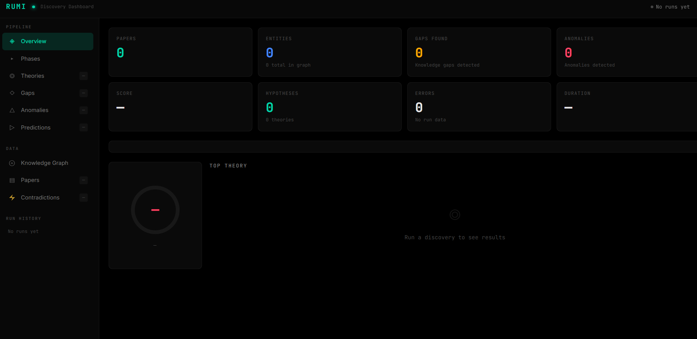

# RUMI — Research & Unified Machine Intelligence

<p align="center">
  
</p>

<p align="center">
  <a href="https://github.com/subhansh-dev/Rumi/stargazers">
    
  </a>
  <a href="https://github.com/subhansh-dev/Rumi/forks">
    
  </a>
  <a href="https://github.com/subhansh-dev/Rumi/issues">
    
  </a>
  <a href="https://github.com/subhansh-dev/Rumi/blob/main/LICENSE">
    
  </a>
  <a href="https://python.org/versions/3.11">
    
  </a>
</p>

<p align="center">
  <b>Autonomous Scientific Cognition Framework</b><br>
  Terminal-native · 44 Brain Modules · 48 Discovery Modules · 17 Domains · Recursive Self-Improvement
</p>

<p align="center">
  
</p>

---

## Abstract

**RUMI** (Research & Unified Machine Intelligence) is an autonomous scientific cognition framework that generates novel, testable, evidence-grounded hypotheses through a multi-phase discovery pipeline. Unlike conventional AI assistants that search and summarize, RUMI implements a 12-phase discovery engine backed by a 44-module cognitive architecture inspired by dual-process theory, the Free Energy Principle, and causal inference frameworks.

The system addresses three fundamental limitations of current AI-assisted research:

1. **Statelessness** — Conventional assistants begin each session from zero. RUMI maintains 9 types of persistent memory with Hebbian learning, episodic recall, and semantic vector search.

2. **Reactivity** — Most tools wait for commands. RUMI implements curiosity-driven exploration, autonomous research goal pursuit, and proactive hypothesis generation.

3. **Shallow reasoning** — Single-pass generation produces correlations, not mechanisms. RUMI implements multi-pass causal reasoning (Pearl's hierarchy), analogical reasoning (Gentner's structure mapping), neurosymbolic verification, and first-principles derivation.

<p align="center">
  
</p>

---

## Table of Contents

- [Motivation](#motivation)
- [Discovery Pipeline v2](#discovery-pipeline-v2)
- [Scientific Rigor Framework](#scientific-rigor-framework)
- [Cognitive Architecture](#cognitive-architecture)
- [Brain Systems](#brain-systems)
- [Results](#results)
- [Installation](#installation)
- [Usage](#usage)
- [Configuration](#configuration)
- [Limitations](#limitations)
- [Future Work](#future-work)
- [Project Structure](#project-structure)
- [Contributing](#contributing)
- [License](#license)

---

## Motivation

Contemporary AI assistants share a fundamental limitation: they are stateless, reactive, and single-model systems. Each session begins from zero — no memory of prior interactions, no model of the user, no awareness of their own capabilities. They wait for commands rather than anticipating needs. They route everything through one inference call regardless of task complexity.

RUMI addresses these limitations by implementing a cognitive architecture that mirrors aspects of human cognition, purpose-built for the scientific research lifecycle:

| Dimension | Conventional Assistants | RUMI |
|-----------|------------------------|-------|
| **Memory** | Stateless per session | 9-type persistent memory with Hebbian learning, episodic recall, semantic vector search, and procedural templates |
| **Initiative** | Reactive — waits for commands | Proactive — curiosity-driven exploration, autonomous research goal pursuit |
| **Reasoning** | Single-pass generation | Multi-pass: cognitive gating, causal (Pearl), analogical (Gentner), neurosymbolic, first-principles |
| **Self-awareness** | None | Self-model with confidence calibration, introspection engine, metacognitive monitoring |
| **Learning** | No feedback loop | Error-driven updates, experience replay, dreaming-based consolidation, meta-learning |
| **Discovery** | Search-and-summarize | 12-phase pipeline: literature → graph → gaps → anomalies → hidden variables → mechanisms → predictions → competition → scoring |
| **Quality Control** | None | Skeptic review, mathematical consistency checking, falsification engine, scientific courtroom |
| **Self-Improvement** | None | Reflexion: analyzes weaknesses, generates patches, tests in sandbox, applies fixes |

---

## Discovery Pipeline v2

RUMI's discovery engine is not a research assistant. It's a discovery engine. The v2 pipeline runs 12 phases, each with algorithmic fallbacks and LLM-powered analysis:

```
Phase 1:  Literature          arXiv + PubMed + Semantic Scholar (multi-query, snowball sampling)
Phase 2:  Knowledge Graph     Algorithmic + LLM entity extraction, relationship building
Phase 3:  Gap Detection       Structural holes, orphan observations, missing mechanisms
Phase 4:  Anomaly Detection   Conflicting evidence, outliers, prediction violations
Phase 5:  Hidden Variables    Propose unseen entities/processes (dark matter style reasoning)
Phase 6:  Mechanisms          Causal pathways with equations, not just correlations
Phase 7:  Predictions         Testable predictions with falsification criteria
Phase 8:  Theory Competition  Multiple competing explanations, scored on 7 dimensions
Phase 9:  Computational       Real graph analysis, Monte Carlo, statistical testing
Phase 10: Contradictions      Scientific tension analysis, competing theory detection
Phase 11: Skeptic Review      Adversarial critique with strengths/weaknesses/failure conditions
Phase 12: Discovery Scoring   7-dimension quality gate (0-100) with grade assignment
```

### Post-Processing Pipeline

After the 12-phase discovery engine, RUMI runs two additional processing layers:

**Refinement Pipeline (13 stages):**
1. Knowledge Foundation Audit — structured map of current knowledge
2. First Principles Reconstruction — dependency trees back to axioms
3. Mathematical Formalization — cap confidence at 20% if no equations
4. Derivation Engine — no free parameters, every variable justified
5. Multi-Model Competition — 5 hypotheses with weighted scoring
6. Adversarial Scientists — 5 reviewer personas (mathematician, experimentalist, domain expert, statistician, skeptic)
7. Causal Reasoning Layer — force causal graphs, not correlations
8. Uncertainty Decomposition — data/model/assumption/measurement
9. Prediction Generator — near/medium/long-term with measurements
10. Simulation Layer — expected behavior, edge cases, failure modes
11. Discovery Classifier — replication/synthesis/extension/novel_theory
12. Researcher-Grade Scoring — 7 metrics (evidence, math rigor, testability, novelty, contradiction handling, reproducibility, confidence)
13. Scientific Courtroom — Prosecutor/Defense/Judge/Jury with self-critique

**Reflexion (Recursive Self-Improvement):**
- PostDiscoveryAnalyzer: identifies weaknesses in discovery runs
- CodePatchGenerator: LLM-powered code fix generation
- SandboxTester: syntax/compile/import checks before applying
- RecursiveImprover: max 3 patches/cycle, confidence > 0.7 to apply
- Git-backed rollback, forbidden files list, full history tracking

### Example Output

```
Topic: Dark energy decay signatures in the cosmic microwave background
Domain: physics | Mode: full | Provider: CEREBRAS | Duration: 200s

Phase 1:  48 papers from 3 sources (arXiv + PubMed + Semantic Scholar)
Phase 2:  68 entities, 53 relationships (LLM-enhanced knowledge graph)
Phase 5:  3 hidden variables:
          - Decaying Dark Energy Scalar (φ)
          - Effective Fine-Structure Variation (α_eff)
          - Late-Time Dark Radiation from Sterile Neutrino Decay (ΔN_eff)

Phase 6:  4 mechanisms with equations:
          [causal_pathway] Scalar Decay → CMB μ-distortion
            → ρ_φ evolves as... produces two photons E_γ≈m_φ/2
          [cascade] Dark-energy-induced α variation → acoustic peak shift
            → L_int = -(ξ/4)(φ/M_Pl)F_μνF^μν, σ_T ∝ α²
          [feedback_loop] Sterile-neutrino decay → ΔN_eff, σ_8 suppression
            → Γ_s = 1/τ_s ≈ (θ²G_F²m_s...

Phase 7:  6 predictions accepted:
          [novel] If φ decays with rate β = 1×10⁻⁶ → CMB μ-distortion
          [interventional] If Δα/α = +1×10⁻³ at recombination...
          [counterfactual] If β = 0 → no μ-distortion

Phase 8:  5 theories compared:
          Early Dark Energy Phase Transition (0.73)
          Decaying Dark-Energy Scalar (0.71)
          Modified Gravity f(R) (0.60)

Phase 11: Skeptic: REVISE (62% confidence)
          Strengths: concrete mechanism, testable signatures
          Weaknesses: requires precise timing, no natural particle-physics model

Score: 80/100 — Grade: B
Classification: extension
```

### 17 Supported Domains

| Domain | Key | Enrichment APIs |
|--------|-----|-----------------|
| Drug Discovery | `drug_discovery` | PubChem + OpenFDA + PDB |
| Materials Science | `materials_science` | PubChem + Materials Project |
| Neuroscience | `neuroscience` | UniProt + PDB |
| Molecular Biology | `molecular_biology` | UniProt + PDB |
| Climate & Energy | `climate_energy` | NASA POWER |
| Space & Astronomy | `space_astronomy` | NASA API + arXiv |
| Computer Science | `computer_science` | GitHub |
| Earth Science | `earth_science` | USGS |
| Oceanography | `oceanography` | NOAA |
| Economics | `economics` | World Bank |
| Public Health | `public_health` | WHO |
| Mathematics | `mathematics` | OEIS + arXiv |
| Social Sciences | `social_science` | OpenAlex |
| Chemistry | `chemistry` | CIR + PubChem |
| Ecology | `ecology` | GBIF |
| Physics | `physics` | arXiv |
| General Science | `general` | Semantic Scholar |

### Key Discovery Modules

| Module | Purpose |
|--------|---------|
| `knowledge_gap_detector` | Find structural holes, orphan observations, missing mechanisms |
| `anomaly_detector` | Find conflicting evidence, outliers, prediction violations |
| `missing_variable_generator` | Propose hidden variables (dark matter style reasoning) |
| `mechanism_generator` | Generate causal pathways with equations |
| `mechanism_discovery` | Search for conservation laws, intermediate variables, energy flow |
| `prediction_engine` | Generate testable predictions with falsification criteria |
| `theory_competition` | Compare multiple explanations, score on 7 dimensions |
| `discovery_scorer` | 7-dimension quality gate with mathematical rigor |
| `computational_verification` | Real graph analysis, Monte Carlo, statistics |
| `domain_ontologies` | Real physics for 17 domains: equations, mechanisms, constraints |
| `math_consistency_checker` | Verify theories: equation parsing, parameter ranges, unit checking |
| `simulation_pipeline` | Monte Carlo testing: 1000 runs, confidence intervals |
| `multi_agent_debate` | 4-role debate: Proposer, Critic, Advocate, Synthesizer |
| `cross_domain_transfer` | 7 built-in analogies + LLM-powered new analogy discovery |
| `continuous_operation` | Autonomous loop: curiosity-driven topic selection |
| `refinement_pipeline` | 13-stage post-processing: audit → formalization → scoring |
| `falsification_engine` | Try to destroy theories: constraints, counterfactuals, adversarial |
| `claim_provenance` | Trace every claim back to its source paper |
| `contradiction_miner` | Scientific tension analysis, competing theory detection |
| `reflexion` | Recursive self-improvement: analyze, patch, test, apply |

---

## Scientific Rigor Framework

RUMI implements multiple layers of quality control to ensure discoveries are scientifically rigorous, not just plausible-sounding:

### 1. Mechanism Validation
Every mechanism must include:
- Causal chain (minimum 3 steps)
- Inputs and outputs with expected magnitudes
- State variables that change during the mechanism
- Observables that can be measured
- Conservation laws where applicable

Generic mechanisms like "Hidden mechanism connecting X and Y" are automatically rejected.

### 2. Prediction Validation
Every prediction must be:
- Quantitative (include numbers, not just direction)
- Testable (specify measurement method)
- Falsifiable (state what would disprove it)

Predictions without meaningful statements are skipped. Predictions with "if...then" structure and concrete values are preferred.

### 3. Theory Competition
Multiple competing explanations are generated and scored on:
- Evidence strength
- Mathematical rigor
- Predictive power
- Falsifiability
- Simplicity (Occam's razor)
- Novelty
- Contradiction handling

Theories that are only correlational (no causal claims) receive a penalty.

### 4. Skeptic Review
Every theory undergoes adversarial critique that requires:
- Strengths (what it explains well)
- Weaknesses (specific, not vague)
- Failure conditions (what would disprove it)
- Destroying evidence (existing contradictions)
- Competing explanations (better alternatives)

The skeptic only recommends "reject" for fundamental logical flaws.

### 5. Scientific Courtroom
Final evaluation uses a Prosecutor/Defense/Judge/Jury structure:
- **Prosecutor**: Attempts to destroy the hypothesis (3 strongest objections)
- **Defense**: Counters each objection with evidence
- **Judge**: Weighs prosecution vs defense, identifies missing evidence
- **Jury**: 5 domain experts vote (theoretical physicist, experimentalist, mathematician, philosopher of science, interdisciplinary researcher)
- **Self-Critique**: The hypothesis critiques itself (weakest assumption, destroying evidence, falsification experiment)

### 6. Discovery Classification
Every output is classified to prevent inflation:
- **Replication**: Confirms existing knowledge
- **Synthesis**: Combines existing ideas
- **Extension**: New application of known mechanisms
- **Novel Theory**: Requires new mechanism, new prediction, new mathematics, and not present in literature

### 7. Mathematical Rigor Scoring
Theories without equations receive a penalty. Scoring checks for:
- Equations/formulas present
- Quantitative content (numbers)
- Derivation stated (derived from, follows from)
- Assumptions stated

### 8. Recursive Self-Improvement (Reflexion)
After every discovery run, RUMI analyzes its own performance:
- Identifies which modules underperformed
- Generates concrete code patches via LLM
- Tests patches in sandbox (syntax, compile, import)
- Applies safe patches with git-backed rollback
- Maximum 3 patches per cycle to prevent runaway

---

## Cognitive Architecture

RUMI routes inputs through a layered pipeline inspired by dual-process theory and cognitive neuroscience:

```
┌─────────────────────────────────────────────────────────────────────┐
│                        PERCEPTION LAYER                              │
│     Voice Input ──► Text ──► Gemini Live API ──► Audio Out           │
└───────────────────────────────────┬──────────────────────────────────┘
                                    │
┌───────────────────────────────────▼──────────────────────────────────┐
│                         MEMORY LAYER                                 │
│  ┌──────────┐ ┌───────────┐ ┌──────────┐ ┌───────────────────┐      │
│  │  Neural  │ │  Episodic │ │  Vector  │ │    Procedural     │      │
│  │ (Hebbian)│ │  (Events) │ │ (Search) │ │  (Skill Memory)   │      │
│  └──────────┘ └───────────┘ └──────────┘ └───────────────────┘      │
│  ┌──────────────────────────────────────────────────────────────┐   │
│  │           Memory Coordinator (unified recall)                 │   │
│  └──────────────────────────────────────────────────────────────┘   │
└───────────────────────────────────┬──────────────────────────────────┘
                                    │
┌───────────────────────────────────▼──────────────────────────────────┐
│                       INFERENCE LAYER                                │
│  Active Inference ──► Prediction-Error Minimization (FEP)            │
│  Curiosity Engine ──► Novelty Detection ──► Exploration Drive        │
│  Cognitive Gating ──► System 1 (fast) vs System 2 (deliberate)      │
└───────────────────────────────────┬──────────────────────────────────┘
                                    │
┌───────────────────────────────────▼──────────────────────────────────┐
│                       REASONING LAYER                                │
│  Causal (Pearl) ──► Analogy (Gentner) ──► Neurosymbolic               │
│  Narrative ──► Creativity ──► Intuition (Recognition-Primed)         │
└───────────────────────────────────┬──────────────────────────────────┘
                                    │
┌───────────────────────────────────▼──────────────────────────────────┐
│                      REFLECTION LAYER                                │
│  Dreaming ──► Experience Replay ──► Pattern Extraction               │
│  Meta-Reflection ──► Decision Journal ──► Strategy Scoring           │
└───────────────────────────────────┬──────────────────────────────────┘
                                    │
┌───────────────────────────────────▼──────────────────────────────────┐
│                      IDENTITY LAYER                                  │
│  Self-Model ──► Self-Awareness ──► Integrated Information (IIT-Φ)    │
│  Theory of Mind ──► Emotional Regulation ──► Metacognitive Monitor   │
│  Global Workspace (Thalamus) ──► Multi-Module Coordination           │
└───────────────────────────────────┬──────────────────────────────────┘
                                    │
┌───────────────────────────────────▼──────────────────────────────────┐
│                      ACTION LAYER                                    │
│  40+ Tool Actions ──► Execution ──► Verification ──► Learning        │
└──────────────────────────────────────────────────────────────────────┘
```

### Research Foundations

RUMI's architecture is grounded in peer-reviewed research:

| Research Area | Researcher(s) | Core Idea | RUMI Implementation |
|--------------|---------------|-----------|---------------------|
| Global Workspace Theory | Bernard Baars (1988) | Consciousness as a broadcast mechanism | `global_workspace.py` — multi-module coordination |
| Integrated Information Theory | Giulio Tononi (2004) | Consciousness as integrated information (Φ) | `integrated_info.py` — Φ approximation |
| Free Energy Principle | Karl Friston (2010) | All adaptive systems minimize prediction error | `active_inference.py` — Bayesian updating |
| Dual Process Theory | Daniel Kahneman (2011) | System 1 (fast) vs System 2 (slow) reasoning | `cognitive_load.py` — gating between systems |
| Recognition-Primed Decisions | Gary Klein (1998) | Experts decide by pattern matching | `intuition_engine.py` — fast pattern matching |
| Structure Mapping Theory | Dedre Gentner (1983) | Analogical reasoning as core intelligence | `analogy_engine.py` — structure mapping |
| Causal Hierarchy | Judea Pearl (2018) | Association → Intervention → Counterfactual | `causal_reasoner.py` — three-level causal inference |
| Society of Mind | Marvin Minsky (1986) | Intelligence as emergent competition | `module_competition.py` — bidding for processing |
| Metacognition | John Flavell (1979) | Thinking about thinking | `metacognitive_monitor.py` — quality tracking |
| Computational Creativity | Margaret Boden (2004) | Exploration, combination, transformation | `creativity_engine.py` — conceptual blending |
| World Models | Ha & Schmidhuber (2018) | Mental simulation before action | `world_model.py` — latent dynamics |
| Self-Determination Theory | Deci & Ryan (1985) | Autonomy, competence, relatedness | `intrinsic_motivation.py` — drive system |
| Free Energy Principle (hierarchical) | Friston (2010) | Meta → Subgoal → Action levels | `hierarchical_active_inference.py` — 3-level FEP |

---

## Brain Systems

### Memory (8 modules)

| Module | File | Purpose |
|--------|------|---------|
| Neural Memory | `neural_memory.py` | Long-term facts with Hebbian learning, synaptic decay, pattern completion |
| Episodic Memory | `episodic_memory.py` | Timestamped events with importance scoring and retrieval |
| Vector Memory | `vector_memory.py` | Semantic search via embeddings for fast retrieval |
| Procedural Memory | `procedural_memory.py` | Learns successful tool chains as reusable skill templates |
| Associative Memory | `associative_memory.py` | Spreading activation networks for context-dependent recall |
| Predictive Memory | `predictive_memory.py` | Anticipatory recall — pre-loads relevant memories before request |
| Memory Consolidation | `memory_consolidation.py` | Sleep-like compression of episodic → semantic knowledge |
| Memory Coordinator | `memory_coordinator.py` | Unified recall across all memory stores |

### Learning & Adaptation (7 modules)

| Module | File | Purpose |
|--------|------|---------|
| Active Inference | `active_inference.py` | Free Energy Principle — minimizes prediction error through Bayesian updating |
| Learning Engine | `learning.py` | Error-driven updates, Q-learning for tool selection, user feedback integration |
| Curiosity Engine | `curiosity.py` | Information-seeking behavior, novelty detection, uncertainty-driven exploration |
| Dreaming System | `dreaming.py` | Offline experience replay, pattern extraction, memory consolidation |
| Meta-Learner | `meta_learner.py` | Learning to learn — extracts transferable learning strategies |
| Transfer Learning | `transfer_learning.py` | Cross-domain pattern transfer and abstraction |
| Self-Improve Engine | `self_improve_engine.py` | RLHF-inspired: stores action-outcome pairs, extracts lessons from failures |

### Reasoning (8 modules)

| Module | File | Purpose |
|--------|------|---------|
| Causal Reasoner | `causal_reasoner.py` | Pearl's Causal Hierarchy — Association → Intervention → Counterfactual |
| Analogy Engine | `analogy_engine.py` | Gentner's Structure Mapping Theory for fluid intelligence |
| Neurosymbolic Reasoner | `neurosymbolic_reasoner.py` | Combines LLM reasoning with SymPy formal logic verification |
| Narrative Intelligence | `narrative_intelligence.py` | Turns experiences into stories, identity evolution tracking |
| Creativity Engine | `creativity_engine.py` | Conceptual blending, constraint relaxation, bisociation for novel ideas |
| Intuition Engine | `intuition_engine.py` | Fast pattern matching — Recognition-Primed Decision Making (System 1) |
| Cognitive Integration | `cognitive_integration.py` | Orchestrates all reasoning modules into a unified cognitive pipeline |
| Module Competition | `module_competition.py` | Minsky Society of Mind — modules bid for processing rights |

### Metacognitive Systems (10 modules)

| Module | File | Purpose |
|--------|------|---------|
| Self-Awareness | `self_awareness.py` | Consciousness state tracking, emotional state management |
| Self-Model | `self_model.py` | Capability awareness, confidence calibration, growth tracking |
| Theory of Mind | `theory_of_mind.py` | User expertise modeling, intent inference, emotional state tracking |
| Metacognitive Monitor | `metacognitive_monitor.py` | Thinking quality tracking, calibration, strategy effectiveness |
| Introspection Engine | `introspection_engine.py` | Confidence calibration, cognitive bias detection (12 types), epistemic humility |
| Integrated Information | `integrated_info.py` | Φ (phi) approximation inspired by Tononi's IIT theory |
| Self-Narrative | `narrative_intelligence.py` | Evolving story of identity, growth, and experience |
| Global Workspace | `global_workspace.py` | Thalamus-inspired multi-module coordination and broadcast |
| Workspace Context | `workspace_context.py` | Context injection from global workspace for situational awareness |
| Workspace Events | `workspace_events.py` | Event types and publishing for inter-module communication |

### Planning & Autonomy (8 modules)

| Module | File | Purpose |
|--------|------|---------|
| Autonomous Planner | `autonomous_planner.py` | MCTS-inspired plan decomposition with dependency tracking |
| Goal Engine | `goal_engine.py` | Hierarchical goal management — life goals → project goals → tasks |
| Intrinsic Motivation | `intrinsic_motivation.py` | Self-Determination Theory: autonomy, competence, relatedness drives |
| Hierarchical Active Inference | `hierarchical_active_inference.py` | 3-level FEP hierarchy: Meta → Subgoal → Action |
| Proactive Engine | `proactive_engine.py` | Anticipates needs, idle check-ins, returning-user greetings |
| Cognitive Load Manager | `cognitive_load.py` | Working memory monitoring (7±2 slots), overload detection |
| AGI Orchestrator | `agi_orchestrator.py` | Master coordinator wiring all cognitive modules into a unified loop |
| Multi-Agent Orchestrator | `multi_agent_orchestrator.py` | Parallel, debate, pipeline, voting, specialist, swarm execution modes |

### Scientific Reasoning & World Models (6 modules)

| Module | File | Purpose |
|--------|------|---------|
| Scientific Reasoning | `scientific_reasoning.py` | Multi-pass scientific reasoning cycle with hypothesis testing |
| Discovery Orchestrator | `discovery_orchestrator.py` | Coordinates discovery pipeline across brain modules |
| Theory Formation | `theory_formation.py` | Bengio-inspired theory engine for forming theories from observations |
| World Model | `world_model.py` | DreamerV3-inspired latent dynamics for outcome prediction |
| Enhanced World Model | `enhanced_world_model.py` | Non-linear MLP transitions, ensemble prediction, causal integration |
| Abstraction Engine | `abstraction_engine.py` | First principles reasoning, cross-domain transfer, emergent insight |

---

## Results

### Performance Metrics

| Metric | Value |
|--------|-------|
| Average discovery score | 70-80/100 (Grade B) |
| Papers per run | 30-50 (3 sources) |
| Entities per graph | 50-75 |
| Mechanisms per run | 3-5 (with equations) |
| Predictions per run | 5-7 (accepted) |
| Theory competition | 5 competing theories |
| Refinement stages | 13 (all complete) |
| Pipeline duration | 150-250 seconds |

### Current Limitations

1. **LLM Rate Limiting**: Free-tier Cerebras (30 req/min) causes some phases to fall back to algorithmic heuristics. Paid tiers or multiple API keys resolve this.

2. **Paper Quality**: arXiv and Semantic Scholar sometimes return unrelated papers for broad queries. Narrow, domain-specific queries produce better results.

3. **Refinement Scoring**: The researcher-grade scoring (Stage 12) sometimes returns F/0 when JSON parsing fails. Text-based fallback extraction is implemented but less accurate.

4. **Domain Specificity**: The pipeline works best for physics, chemistry, and biology. Social sciences and humanities have less domain-specific ontologies.

5. **No GPU**: All computation is CPU-bound. Monte Carlo simulations and graph analysis are slower than GPU-accelerated alternatives.

---

## Installation

### Prerequisites

| Requirement | Details |
|-------------|---------|
| Python | 3.11+ ([download](https://python.org/downloads)) |
| Git | Any recent version |
| OS | Windows (primary), Linux/macOS (partial) |
| RAM | 4GB+ (8GB recommended) |
| API Keys | Cerebras (free) at [cloud.cerebras.ai](https://cloud.cerebras.ai) + Gemini (free) at [aistudio.google.com](https://aistudio.google.com/app/apikey) + Groq (free) at [console.groq.com/keys](https://console.groq.com/keys) |

### Quick Start

```bash
git clone https://github.com/subhansh-dev/Rumi
cd rumi
pip install -e .
playwright install chromium
rumi
```

On first launch, RUMI prompts for your Cerebras, Gemini, and Groq API keys and saves them to `config/api_keys.json`.

### Troubleshooting

| Problem | Solution |
|---------|----------|
| `ModuleNotFoundError` | Run `pip install -e .` from project root |
| First launch doesn't appear | Delete `config/api_keys.json` and restart |
| `playwright not found` | Run `playwright install chromium` |
| Cerebras rate limit errors | Normal for free tier — pipeline auto-retries with 5s backoff |
| `sounddevice` fails on Linux | `sudo apt install portaudio19-dev` |
| `pip install -e .` fails on macOS | `pip3 install -e .` + `xcode-select --install` |

---

## Usage

### Discovery

```bash
# Natural language (triggers full 12-phase pipeline)
"run a discovery on fast radio bursts"
"research the multiverse theory"

# Slash command
/discover Oumuamua interstellar object
/discover drug_discovery: KRAS G12C inhibitor resistance

# Python API
from discovery.discovery_pipeline_v2 import run_discovery_pipeline
result = run_discovery_pipeline("anomalous stellar dimming", mode="full")
```

### Dashboard

After running a discovery, open the interactive dashboard to explore results:

```
/dashboard
```

The dashboard shows:
- **Overview** — metric cards, pipeline phase strip, discovery score gauge
- **Phases** — all 12+ pipeline phases with status and data
- **Theories** — theory competition results with scores
- **Gaps** — knowledge gaps detected in the literature
- **Anomalies** — anomalies and outlier entities
- **Predictions** — testable predictions with confidence
- **Knowledge Graph** — interactive vis-network graph
- **Papers** — searchable paper list
- **Run History** — all past discovery runs with scores

<p align="center">
  
</p>

### Slash Commands

| Command | Description |
|---------|-------------|
| `/discover <topic>` | Full 12-phase discovery pipeline |
| `/search <query>` | Quick PubMed search |
| `/dashboard` | Open interactive web dashboard |
| `/contradictions` | Detect contradictions in knowledge graph |
| `/simulate <hypothesis>` | Monte Carlo simulation |
| `/debate <hypothesis>` | 4-agent debate |
| `/continuous [N]` | N autonomous research cycles |
| `/transfer <domain>:<mech> to <domain>` | Cross-domain transfer |
| `/curiosity` | RUMI's research frontier |
| `/evolve` | Theory evolution status |
| `/consistency` | Math consistency check |
| `/reflexion stats` | Self-improvement statistics |
| `/reflexion history` | Self-improvement history |
| `/status` | System status and uptime |
| `/stats` | Session statistics |
| `/help` | Show all commands |

### Cognitive Tools

```python
# Multi-module cognitive reasoning
cognitive_reason(query="What are the implications of category theory for neural network generalization?", depth="deep")

# Analogy reasoning
analogy_reason(source_domain="biology", target_domain="software_engineering",
               query="How does immune system adaptation inform microservice architecture?")

# Causal analysis
causal_analyze(events="The model performed well on training but failed on test.",
               question="what caused the generalization gap?")

# Creative problem solving
creative_solve(problem="Design a new activation function", constraints="differentiable, efficient", num_ideas=5)
```

### Scientist Agents

```python
agency_agent(agent_name="literature_reviewer", task="Review mechanistic interpretability of transformers")
agency_agent(agent_name="hypothesis_generator", task="Generate hypotheses about scale and emergent abilities")
agency_agent(agent_name="experiment_designer", task="Design experiment to test chain-of-thought emergence")
agency_agent(agent_name="peer_reviewer", task="Review this paper for methodological rigor")
```

### Memory & Learning

```python
save_memory(category="identity", key="name", value="Sir")
brain_memory(action="search", query="preferred programming language")
record_learning(insight="Users prefer direct answers", domain="communication")
reflect_learning(force=True)
```

---

## Configuration

| File | Purpose |
|------|---------|
| `config/api_keys.json` | Cerebras + Gemini + Groq API keys (auto-generated on first launch) |
| `core/prompt.txt` | System personality prompt |
| `RUMI.md` | Identity and behavioral guidelines |
| `SOUL.md` | Core directives and red lines |
| `USER.md` | User profile |
| `memory/` | Persistent memory (long-term + daily logs) |

### Environment Variables

| Variable | Description |
|----------|-------------|
| `RUMI_TELEGRAM_BOT_TOKEN` | Telegram bot token |
| `RUMI_TELEGRAM_ALLOWED_USER` | Allowed Telegram user ID |

---

## Telegram Integration

1. Open Telegram → search **@BotFather** → send `/newbot` → save the token
2. Search **@userinfobot** → send any message → save your numeric User ID
3. Add to `config/api_keys.json`:

```json
{
    "GOOGLE_API_KEY": "your-gemini-key",
    "telegram_bot_token": "7234567890:AAH...",
    "telegram_allowed_user": 123456789
}
```

4. Launch RUMI → send a message to your bot → RUMI responds in terminal and Telegram

Only the configured `telegram_allowed_user` can communicate with RUMI via Telegram.

---

## Project Structure

```
rumi/
├── main.py                      # Entry point (~9000 lines)
├── ui.py                        # Terminal UI (Rich + prompt_toolkit)
├── rumi_launcher.py             # Console entry point
├── rumi_llm.py                  # Unified LLM helper (Cerebras→Groq→Gemini)
├── thinking_loop.py             # Multi-pass reasoning engine
├── telegram_bot.py              # Telegram bridge
├── RUMI.md                      # Identity
├── SOUL.md                      # Core directives
├── USER.md                      # User profile
│
├── discovery/                   # Scientific Discovery Engine (48 modules)
│   ├── discovery_pipeline_v2.py #   12-phase discovery pipeline (ACTIVE)
│   ├── domains.py               #   17 domain configurations
│   ├── graph.py                 #   Knowledge graph + metrics
│   ├── hypothesis_engine.py     #   Hypothesis generation
│   ├── hypothesis_tournament.py #   GFlowNet-style evolution
│   ├── knowledge_gap_detector.py#   Structural holes, orphan observations
│   ├── anomaly_detector.py      #   Conflicting evidence, outliers
│   ├── mechanism_generator.py   #   Causal pathways with equations
│   ├── mechanism_discovery.py   #   Conservation laws, energy flow
│   ├── prediction_engine.py     #   Testable predictions
│   ├── theory_competition.py    #   Multi-theory scoring
│   ├── falsification_engine.py  #   Try to destroy theories
│   ├── computational_verification.py # Real computations
│   ├── discovery_scorer.py      #   7-dimension quality gate
│   ├── refinement_pipeline.py   #   13-stage post-processing
│   ├── multi_agent_debate.py    #   4-role adversarial debate
│   ├── simulation_pipeline.py   #   Monte Carlo (1000 runs)
│   ├── math_consistency_checker.py # Equation validation
│   ├── domain_ontologies.py     #   Real physics for 17 domains
│   ├── cross_domain_transfer.py #   Cross-field analogies
│   ├── continuous_operation.py  #   Autonomous research loop
│   ├── citation_grounding.py    #   Multi-source paper fetch
│   ├── contradiction_miner.py   #   Scientific tension analysis
│   ├── novelty_detector.py      #   PubMed novelty estimation
│   ├── skeptic_agent.py         #   Adversarial critique
│   ├── claim_provenance.py      #   Claim source tracking
│   ├── link_predictor.py        #   Missing connection prediction
│   ├── llm_client.py            #   Cerebras→Groq→Gemini routing
│   ├── pubchem.py               #   PubChem enrichment
│   ├── openfda.py               #   OpenFDA enrichment
│   ├── uniprot.py               #   UniProt enrichment
│   ├── pdb.py                   #   Protein Data Bank
│   ├── semantic_scholar.py      #   Paper citations
│   ├── materials_project.py     #   Crystal structures
│   ├── nasa_api.py              #   NASA data
│   ├── arxiv_api.py             #   arXiv papers
│   ├── gbif_api.py              #   Biodiversity data
│   ├── molecule.py              #   Molecule design (RDKit)
│   └── dashboard/
│       └── index.html           #   Interactive web dashboard
│
├── brain/                       # Cognitive Architecture (44 modules)
│   ├── neural_memory.py         #   Hebbian learning
│   ├── episodic_memory.py       #   Event recording
│   ├── vector_memory.py         #   Semantic search
│   ├── active_inference.py      #   Free Energy Principle
│   ├── curiosity.py             #   Novelty detection
│   ├── dreaming.py              #   Experience replay
│   ├── causal_reasoner.py       #   Pearl's causal hierarchy
│   ├── analogy_engine.py        #   Gentner structure mapping
│   ├── creativity_engine.py     #   Conceptual blending
│   ├── self_awareness.py        #   Consciousness tracking
│   ├── self_model.py            #   Capability awareness
│   ├── theory_of_mind.py        #   User modeling
│   ├── metacognitive_monitor.py #   Thinking quality
│   ├── global_workspace.py      #   Thalamus coordination
│   ├── agi_orchestrator.py      #   Master cognitive loop
│   ├── self_improve_engine.py   #   RLHF-inspired improvement
│   ├── reflexion.py             #   Recursive self-improvement
│   ├── scientific_reasoning.py  #   Multi-pass scientific reasoning
│   ├── discovery_orchestrator.py#   Discovery coordination
│   ├── theory_formation.py      #   Theory engine
│   ├── abstraction_engine.py    #   First principles
│   └── ... (30 more modules)
│
├── scientist/                   # Scientist AI (20 files)
│   ├── discovery_engine.py      #   Full discovery pipeline
│   ├── experiment_designer.py   #   Experiment design
│   ├── paper_generator.py       #   Academic paper generation
│   ├── research_team.py         #   5-role multi-agent debate
│   └── pipeline.py              #   12-phase enhanced research pipeline
│
├── actions/                     # Tool actions (14 files)
├── security/                    # Security (7 files)
├── skills/                      # Skill engine (12 files)
├── agent/                       # Task execution (4 files)
├── agents/scientist/            # 11 research agent personas
├── config/                      # Configuration
├── memory/                      # Persistent memory
└── data/                        # Runtime data + discovery reports
```

---

## Run RUMI with AI Assistants

### With Hermes Agent

```
Hey Hermes, I have RUMI at C:\Users\Admin\Desktop\rumi.
Run RUMI's full scientist pipeline to do an edge discovery
in the space astronomy domain. Topic: anomalous stellar
dimming and technosignature detection.
```

### With Claude Code

```
Claude, I have a scientific discovery AI called RUMI at
C:\Users\Admin\Desktop\rumi. Run the full pipeline to
generate novel hypotheses about dark matter detection
methods. Use the physics domain.
```

**Tips:**
- Always specify the domain: `space_astronomy`, `drug_discovery`, `physics`, etc.
- Use `mode="full"` for complete pipeline (all 12 phases)
- Use `mode="quick"` for fast exploration
- Reports save to `data/` as JSON

---

## Future Work

1. **GPU Acceleration**: Monte Carlo simulations and graph analysis would benefit from GPU acceleration (CuPy, PyTorch Geometric).

2. **Multi-Key Cerebras**: Support multiple Cerebras API keys to bypass rate limiting on free tiers.

3. **Persistent Knowledge Graph**: Move from JSON-based graph to a proper graph database (Neo4j, ArangoDB) for faster traversal and querying.

4. **Domain-Specific Fine-Tuning**: Fine-tune the hypothesis generator on domain-specific corpora to improve output quality.

5. **Automated Experiment Design**: Generate complete experiment protocols with materials, methods, and statistical analysis plans.

6. **Paper Generation**: Generate publication-ready papers from discovery results with proper citations and formatting.

7. **Collaborative Discovery**: Multi-user discovery sessions where multiple researchers can contribute hypotheses and evidence.

8. **Real-Time Literature Monitoring**: Continuously monitor arXiv, PubMed, and Semantic Scholar for new papers relevant to active discoveries.

---

## Contributing

Contributions welcome. Please read [CONTRIBUTING.md](CONTRIBUTING.md) first.

```bash
git clone https://github.com/subhansh-dev/Rumi.git
cd rumi
pip install -r requirements.txt
python main.py
```

---

## License

[MIT](LICENSE) — Copyright (c) 2026 Subhansh

---

<p align="center">
  <sub>Built by Subhansh · RUMI v2.1</sub>
</p>
