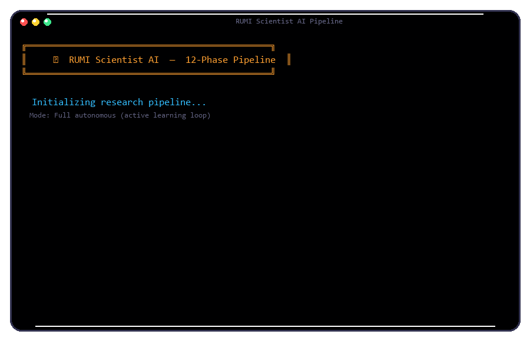

<p align="center">
  
</p>

<p align="center">
  <a href="https://github.com/subhansh-dev/Rumi/stargazers"></a>
  <a href="https://github.com/subhansh-dev/Rumi/forks"></a>
  <a href="https://github.com/subhansh-dev/Rumi/issues"></a>
  <a href="LICENSE"></a>
  <a href="https://python.org/versions/3.12"></a>
</p>

<p align="center">
  <b>Terminal-native autonomous AI for scientific research.</b><br>
  15 Scientist AI modules · 60+ cognitive brain modules · Zero bloat
</p>

---

## Quick Start

```bash
pip install -e .
playwright install chromium
rumi
```

```python
# Run a full research pipeline
scientist_pipeline(action="run", topic="emergent abilities in large language models")
```

<p align="center">
  
</p>

---

## Features

| | Category | |
|-|----------|-|
| 🔬 | **Scientist AI** — discovery pipeline, novelty checking, hypothesis generation, experiment design, paper generation, peer review, reproducibility verification, knowledge graphs, cross-domain transfer, lab notebook | 15 modules |
| 🧠 | **Cognition** — causal reasoning (Pearl), analogy (Gentner), neurosymbolic, active inference, curiosity-driven exploration, metacognition, creativity, dreaming | 60+ modules |
| 🌐 | **Research** — arXiv/Semantic Scholar search, deep web research, browser-based literature collection | Multi-source |
| 🧠 | **Memory** — neural, episodic, vector, procedural, associative, predictive, consolidated, working, global workspace | 9 types |
| 🤖 | **Scientist Agents** — literature reviewer, hypothesis generator, experiment designer, paper writer, peer reviewer, novelty analyst, cross-domain bridge, reproducibility engineer, data analyst, knowledge curator, research coordinator | 11 personas |
| 📊 | **Data** — CSV/JSON analysis, chart generation, statistical testing, Bayesian inference | Polars + Matplotlib |
| 🔄 | **Learning** — error-driven updates, experience replay, dreaming-based consolidation, meta-learning, Q-learning | Online |
| 🛡️ | **Security** — permission management, audit logging, rate limiting, input sanitization, config validation | Built-in |

---

## Scientist AI Pipeline

RUMI automates the full research lifecycle through 15 integrated modules:

```
Idea → Novelty Check → Hypothesis Generation → Experiment Design
  → Execution → Analysis → Paper Generation → Peer Review
```

| Module | Purpose |
|--------|---------|
| **Discovery Engine** | End-to-end: idea → novelty check → experiment → paper |
| **Tournament Hypotheses** | GFlowNet-inspired diverse hypothesis generation with evolutionary selection |
| **Knowledge Graph** | Multi-hop reasoning, gap detection, paper ingestion across scientific domains |
| **Reproducibility Engine** | Extract claims, generate reproduction code, score reproducibility |
| **Research Team** | 5-role multi-agent debate (Lead, Methodologist, Critic, Analyst, Scribe) |
| **Active Experiment Selector** | Bayesian optimal experiment selection maximizing information gain |
| **Cross-Domain Connector** | Transfer insights between physics, biology, CS, economics, chemistry, and more |
| **Lab Notebook** | Digital lab notebook for experiments, observations, measurements, results |
| **Paper Generator** | Generate academic papers and research reports from findings |
| **Novelty Checker** | Assess novelty against existing literature |
| **Experiment Designer** | Design controlled experiments with hypothesis testing |
| **Feynman Reducer** | Feynman technique — explain complex ideas simply |
| **Peer Reviewer** | Automated peer review with methodological critique |
| **Cross-Validator** | Cross-validate findings across multiple sources and methods |
| **Scientist Search** | Search papers by famous researchers with citation analysis |
| **Pipeline Orchestrator** | 12-phase enhanced pipeline with active learning loop, BibTeX, self-improvement |

<p align="center">
  
</p>

---

## Cognitive Architecture

RUMI routes research queries through a multi-layer pipeline inspired by cognitive science:

```
Input → Perception → Memory (9-type recall) → Inference (active inference)
  → Reasoning (causal/analogy/neurosymbolic) → Reflection (dreaming/replay)
    → Identity (self-model/consciousness) → Action (tools/agents)
```

### Research Foundations

| Idea | Source |
|------|--------|
| **Global Workspace Theory** | Baars (1988) — consciousness as broadcast mechanism |
| **Integrated Information Theory** | Tononi (2004) — Φ as measure of consciousness |
| **Free Energy Principle** | Friston (2010) — prediction-error minimization |
| **Dual Process Theory** | Kahneman (2011) — System 1 fast / System 2 deliberate |
| **Structure Mapping Theory** | Gentner (1983) — analogy as core of intelligence |
| **Causal Hierarchy** | Pearl (2018) — association → intervention → counterfactual |
| **Society of Mind** | Minsky (1986) — emergent competition between simple agents |
| **Recognition-Primed Decisions** | Klein (1998) — expert pattern matching |
| **World Models** | Ha & Schmidhuber (2018) — mental simulation before action |

---

## Installation

### Prerequisites

| Requirement | Details |
|-------------|---------|
| Python | 3.12+ |
| OS | Windows, Linux, macOS |
| RAM | 4GB+ (8GB recommended) |
| Storage | ~500MB + ~400MB for Playwright |
| API Key | Free Gemini API key at [aistudio.google.com](https://aistudio.google.com/app/apikey) |

### Setup

```bash
# Clone
git clone https://github.com/subhansh-dev/Rumi
cd rumi

# Virtual environment
python -m venv rumi_env
rumi_env\Scripts\activate      # Windows
source rumi_env/bin/activate   # Linux/macOS

# Install
pip install -e .

# Browser for research
playwright install chromium
```

### Configure

Edit `config/api_keys.json`:

```json
{
    "GOOGLE_API_KEY": "your-gemini-api-key-here",
    "os_system": "windows"
}
```

### Launch

```bash
rumi
```

### Troubleshooting

| Problem | Solution |
|---------|----------|
| `ModuleNotFoundError` | Activate venv, run `pip install -e .` |
| `GOOGLE_API_KEY not found` | Check `config/api_keys.json` |
| `playwright not found` | Run `playwright install chromium` |
| `No module named 'brain.*'` | Run from project root (`rumi/`) |

---

## Configuration

| File | Purpose |
|------|---------|
| `config/api_keys.json` | Gemini API key and settings |
| `core/prompt.txt` | System personality prompt |
| `RUMI.md` | Identity and behavioral guidelines |
| `SOUL.md` | Core directives and red lines |
| `USER.md` | User profile |
| `memory/` | Persistent memory |

---

## Telegram Integration

Chat with RUMI remotely via Telegram.

1. Create a bot: message **@BotFather** on Telegram → `/newbot` → save the token
2. Get your user ID: message **@userinfobot** → save the number
3. Configure:

```json
{
    "GOOGLE_API_KEY": "your-key",
    "telegram_bot_token": "7234567890:AAH...",
    "telegram_allowed_user": 123456789,
    "os_system": "windows"
}
```

4. Launch RUMI and send a message to your bot.

> Only the configured `telegram_allowed_user` can communicate with RUMI.

---

## Usage

### Commands

| Command | Description |
|---------|-------------|
| `/help` | Show help |
| `/science` | Scientist AI capabilities |
| `/discover` | Run autonomous discovery |
| `/hypothesize` | Generate diverse hypotheses |
| `/experiment` | Design or run an experiment |
| `/papers` | Search academic papers |
| `/review` | Peer review a claim |
| `/graph` | Knowledge graph operations |
| `/notebook` | Lab notebook operations |
| `/focus` | Toggle focus mode |
| `/think` | Toggle reasoning mode |
| `/status` | System status and uptime |
| `/exit` | Exit RUMI |

---

## Example Prompts

### 🔬 Scientist AI — Research Pipeline

```
# Full autonomous research (12 phases)
scientist_pipeline(action="run", topic="emergent abilities in large language models beyond 100B parameters")

# Quick literature + novelty + hypothesis scan
scientist_pipeline(action="quick", topic="neuro-symbolic approaches to mathematical reasoning")

# Curiosity-driven exploration
scientist_pipeline(action="explore", topic="")

# Iterative pipeline with self-improvement
scientist_pipeline(action="iterate", topic="attention mechanisms in transformer architectures", domain="machine_learning")

# Pipeline history
scientist_pipeline(action="history")
scientist_pipeline(action="stats")
```

### 🔬 Scientist AI — Analysis & Validation

```
# Novelty check a research idea
scientist_analyze(action="novelty", topic="using active inference for robot motor control")

# Feynman reduction — simplify a complex concept
scientist_analyze(action="feynman", topic="the Higgs mechanism")

# Peer review findings
scientist_analyze(action="review", topic="transformer efficiency", findings='[{"claim": "Sparse attention reduces compute by 40%"}]')

# Cross-validate results
scientist_analyze(action="validate", topic="quantum machine learning")
```

### 🔬 Scientist AI — Experiments & Papers

```
# Design an experiment
scientist_experiment(action="design", hypothesis="Vision transformers scale better than ConvNets on small datasets", domain="machine_learning", experiment_type="ablation")

# Generate a paper
scientist_paper(action="generate", topic="The Role of Induction Heads in In-Context Learning", hypothesis="Induction heads are the primary mechanism for in-context learning", venue="neurips")

# Search papers by researcher
scientist_search(action="search", researcher="Richard Feynman", topic="quantum electrodynamics")

# Academic search
paper_search(query="mixture of experts in large language models", max_results=15)
```

### 🔬 Scientist AI — Knowledge & Hypotheses

```
# Generate diverse hypotheses
scientist_tournament(action="generate", topic="scaling laws for mixture-of-experts models", domain="computer_science", size=10, generations=5)

# Run hypothesis tournament
scientist_tournament(action="tournament", topic="energy-based models vs diffusion models for image generation")

# Knowledge graph operations
scientist_knowledge_graph(action="add_entity", name="attention_is_all_you_need", entity_type="paper", description="Vaswani et al. 2017", domain="machine_learning")
scientist_knowledge_graph(action="query", name="transformer")
scientist_knowledge_graph(action="gaps", domain="machine_learning")

# Cross-domain analogy
scientist_cross_domain(action="analogy", concept="natural selection", source_domain="biology", target_domain="machine_learning")

# Lab notebook
scientist_lab_notebook(action="create", title="Testing Grokking on Modular Addition", hypothesis="Transformers grok modular addition through Fourier features", domain="machine_learning")

# Reproducibility check
scientist_reproducibility(action="extract", text="[paper text here]")
```

### 🤖 Scientist Agents

```
# Literature review
agency_agent(agent_name="literature_reviewer", task="Review recent advances in mechanistic interpretability of transformers")

# Hypothesis generation
agency_agent(agent_name="hypothesis_generator", task="Generate novel hypotheses about the relationship between model scale and emergent abilities")

# Experiment design
agency_agent(agent_name="experiment_designer", task="Design an experiment to test whether chain-of-thought reasoning emerges from next-token prediction")

# Paper writing
agency_agent(agent_name="paper_writer", task="Write a paper on our findings about scaling laws", context="[findings data here]")

# Peer review
agency_agent(agent_name="peer_reviewer", task="Review this paper for methodological rigor", context="[paper text here]")

# Novelty analysis
agency_agent(agent_name="novelty_analyst", task="Assess whether this research idea is novel", context="[idea description here]")

# Cross-domain bridge
agency_agent(agent_name="cross_domain_bridge", task="What can reinforcement learning learn from evolutionary biology?")

# Reproducibility check
agency_agent(agent_name="reproducibility_engineer", task="Check if these claims are reproducible", context="[paper claims here]")

# Data analysis
agency_agent(agent_name="data_analyst", task="Analyze these experiment results and extract insights", context="[data here]")

# Knowledge curation
agency_agent(agent_name="knowledge_curator", task="Extract key entities and relationships from this paper", context="[paper text here]")

# Full research coordination
agency_agent(agent_name="research_coordinator", task="Coordinate a full research pipeline on sparse autoencoders for LLM interpretability")
```

### 🧠 Cognitive Reasoning

```
# Multi-module cognitive reasoning
cognitive_reason(query="What are the implications of category theory for understanding neural network generalization?", depth="deep")

# Analogy reasoning
analogy_reason(source_domain="biology", target_domain="software_engineering", query="How does immune system adaptation inform modular architecture design?")

# Causal analysis
causal_analyze(events="The model performed well on training data but failed on the test set.", question="what caused the generalization gap?")

# Creative problem solving
creative_solve(problem="Design a new loss function that prevents mode collapse in GANs", constraints="must be differentiable, computationally efficient", num_ideas=5)

# Consciousness state
consciousness_state(action="full")
```

### 🌐 Research Tools

```
# Paper search
paper_search(query="attention mechanisms in transformer architectures", max_results=10)

# Search by author
scientist_search(action="search", researcher="Andrej Karpathy", topic="language models")

# Deep research
web_research(query="comparison of Mamba vs Transformer architectures", depth=2, max_results=5)

# Browser-based research
browser_control(action="go_to", url="https://arxiv.org/search/?query=active+inference&searchtype=all")
```

### 📊 Data Analysis

```
# Analyze a CSV
data_analysis(action="analyze", filepath="data/results.csv")

# Query data
data_analysis(action="query", filepath="data/results.csv", query="accuracy > 0.9")

# Generate chart
data_analysis(action="chart", filepath="data/results.csv", chart_type="line", chart_title="Model Accuracy Comparison", save_path="charts/accuracy.png")
```

### 🧠 Memory & Learning

```
# Save a fact
save_memory(category="identity", key="name", value="Sir")

# Search memory
brain_memory(action="search", query="preferred research domain")

# Record learning
record_learning(insight="Users prefer direct answers without greeting phrases", domain="communication")

# Metacognitive reflection
reflect_learning(force=True)
```

### 🔄 System

```
# System health
system_sentinel(action="status")

# AGI orchestrator status
agi_status(action="status")

# Dream/replay cycle
run_dream_cycle()

# Curiosity queue
curiosity_queue(action="queue")

# Cognitive load
cognitive_load_check(action="status")

# Force learning
force_learning()
```

---

## Project Structure

```
rumi/
├── main.py                      # Entry point
├── ui.py                        # Terminal UI
├── rumi_launcher.py             # Console entry point
├── thinking_loop.py             # Multi-pass reasoning
├── telegram_bot.py              # Telegram bridge
├── RUMI.md / SOUL.md / USER.md # Identity
├── TOOLS.md                     # Tool documentation
├── HEARTBEAT.md                 # Health checks
├── LICENSE                      # MIT
│
├── brain/                       # Cognitive systems (60+ files)
│   ├── neural_memory.py         #   Hebbian learning
│   ├── episodic_memory.py       #   Event recording
│   ├── vector_memory.py         #   Semantic search
│   ├── active_inference.py      #   Free Energy Principle
│   ├── causal_reasoner.py       #   Pearl's hierarchy
│   ├── analogy_engine.py        #   Gentner structure mapping
│   ├── curiosity.py             #   Novelty detection
│   ├── dreaming.py              #   Experience replay
│   ├── self_awareness.py        #   Consciousness tracking
│   ├── self_model.py            #   Capability awareness
│   ├── metacognitive_monitor.py #   Thinking quality
│   ├── integrated_info.py       #   IIT Φ consciousness
│   ├── global_workspace.py      #   Thalamus coordination
│   ├── autonomous_planner.py    #   MCTS planning
│   ├── agi_orchestrator.py      #   Master cognitive loop
│   └── ... (60+ total)
│
├── scientist/                   # Scientist AI (16 files)
│   ├── discovery_engine.py      #   Full pipeline
│   ├── pipeline.py              #   12-phase orchestrator
│   ├── novelty_checker.py       #   Novelty assessment
│   ├── experiment_designer.py   #   Experiment design
│   ├── paper_generator.py       #   Paper generation
│   ├── peer_reviewer.py         #   Automated review
│   ├── feynman_reducer.py       #   Simple explanations
│   ├── cross_validator.py       #   Cross-validation
│   ├── research_team.py         #   Multi-agent debate
│   ├── tournament_hypothesis.py #   Hypothesis generation
│   ├── knowledge_graph.py       #   Scientific KG
│   ├── reproducibility_engine.py#   Claim reproduction
│   ├── cross_domain_connector.py#   Domain transfer
│   ├── lab_notebook.py          #   Lab notebook
│   └── scientist_search.py      #   Paper search
│
├── actions/                     # Tool actions
│   ├── web_search.py            #   Quick search
│   ├── web_research.py          #   Deep research
│   ├── paper_search.py          #   Academic search
│   ├── browser_control.py       #   Browser automation
│   ├── agency_agent.py          #   Scientist agents
│   ├── research_pipeline.py     #   Pipeline wrapper
│   ├── ai_pipeline.py           #   Text processing
│   ├── file_controller.py       #   File operations
│   ├── dev_agent.py             #   Project generation
│   └── ...
│
├── agents/scientist/            # 11 research agent personas
├── security/                    # Permission & audit
├── skills/                      # Cognitive skills
├── config/                      # Configuration
├── memory/                      # Persistent memory
└── assets/                      # Images and media
```

---

## Contributing

Contributions welcome. See [CONTRIBUTING.md](CONTRIBUTING.md).

```bash
git clone https://github.com/subhansh-dev/Rumi.git
cd rumi
pip install -r requirements.txt
python main.py
```

---

## License

[MIT](LICENSE) — Copyright (c) 2026 Subhansh

---

<p align="center">
  <sub>Built by Subhansh · RUMI v2.0</sub>
</p>
